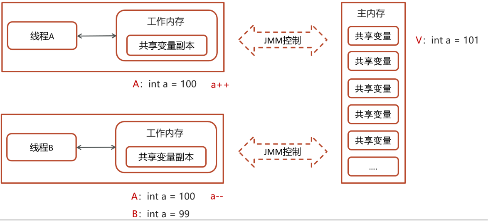
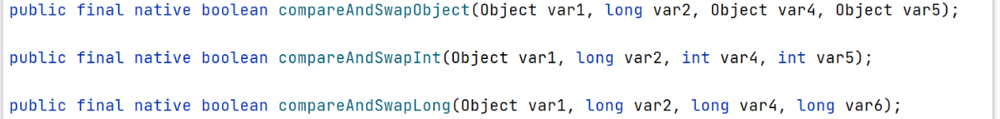
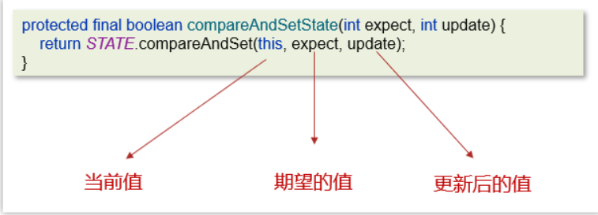

## CAS 是什么？

CAS的全称是： Compare And Swap(比较再交换)，将比较和交换封装成一个指令确保原子性。它体现的一种乐观锁的思想，在无锁情况下保证线程操作共享数据的原子性。

> 工作原理：

* 比较（Compare）： CAS会检查内存中的某个值是否与预期值相等。
* 交换(Swap)：如果相等，将将内存中的值更新为新值。
* 失败重试：如果不想等，说明由其他线程已经修改了该值，CAS操作失败，一般会用重试（锁的自旋），直到成功。


> 举个例子：

在 JMM中，操作数据的过程

同时两个线程：

线程1：从主内存中取出数据a = 100,到线程1的工作内存，进行a++操作

线程2：从主内存中取出数据a = 100,到线程2的工作内存，进行a--操作

过程：

线程1

- 线程1拿A的值与主内存V的值进行比较，判断是否相等
- 如果相等，则把B的值101更新到主内存中
- 由于比较和交换是原子操作，确保了比较时候的数据是一样的但是交换时候数据发生改变（同时cas具体的体现，库存超卖，使用乐观锁 sql解决）。




线程2：从主内存中取出数据a = 100,到线程2的工作内存，进行a--操作

* 线程2拿A的值与主内存V的值进行比较，判断是否相等(目前不相等，因为线程1已更新V的值99)

* 不相等，则线程2更新失败

* 自旋锁操作

  - 因为没有加锁，所以线程不会陷入阻塞，效率较高

  - 如果竞争激烈，重试频繁发生，效率会受影响

  - ```java
    //不断尝试
    while(true){
        int  工作内存中的A = 共享变量A;
        int  结果A = 工作内存中的A - 1;
        if(compareAndSwap(工作内存中的A,共享变量的A){
            //相等就 赋值新结果 跳出循环。
            //不相等就再次尝试
        })
    }
    ```


> CAS的底层实现

CAS 底层依赖于一个 Unsafe 类来直接调用操作系统底层的 CAS 指令。



都是native修饰的方法，由系统提供的接口执行，并非java代码实现，一般的思路也都是自旋锁实现

在java中比较常见使用有很多，比如ReentrantLock和Atomic开头的线程安全类，都调用了Unsafe中的方法

ReentrantLock中的一段CAS代码




> CAS的优缺点

优点

* 无锁并发：没有使用锁，不会影响性能。
* 原子性：保证了线程安全。

缺点

* ABA问题：CAS操作中，一个变量的值从A变成B,又变回A,CAS无法检测到这种变化。可能导致错误
* 自旋开销：CAS操作通过自旋实现，可能导致CPU资源浪费
* 单变量限制：CAS操作仅适用于单个变量的更新


> ABA问题的解决

引入版本号或者时间戳，本次变化都改变版本号或时间戳，用版本号和时间戳来表示是否变化

