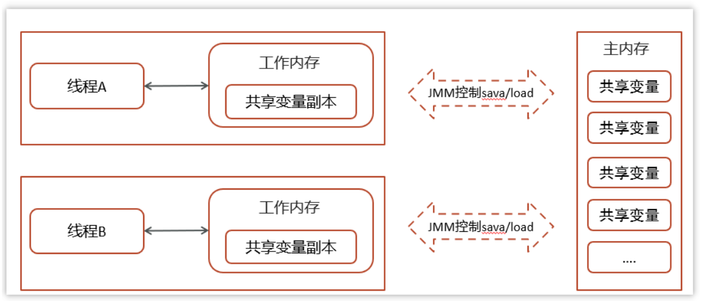

## JMM是什么？

JMM(Java Memory Model)Java内存模型,是java虚拟机规范中所定义的一种内存模型。

Java内存模型(Java Memory Model)描述了Java程序中各种变量(线程共享变量)的访问规则，以及在JVM中将变量存储到内存和从内存中读取变量这样的底层细节。

1. 在JMM中，内存被划分为两个主要区域：主内存和工作内存。
   1. **主内存**：是共享内存区域，所有线程都可以访问，用于存储共享变量。在Java中，堆和方法区是主内存的一部分。
   2. **工作内存**：是线程私有的内存区域，每个线程都有一个独立的工作内存，用于存储线程的私有变量以及从主内存中复制的共享变量副本。在Java中，程序计数器、虚拟机栈和本地方法栈是工作内存的一部分。
2. 特征

1. **可见性**：指一个线程修改了共享变量的值后，其他线程能够立即看到这个修改。在JMM中，通过read、load、store和write四种原子操作来实现主内存和工作内存之间的数据交互，从而保证可见性。
2. **有序性**：指程序中的指令按照特定的顺序执行，前一个指令执行完毕，后一个指令才能执行。JMM通过一系列规则（如happens-before规则）来确保指令的有序性。
3. **原子性**：指一个操作是不可分割的，在执行期间不能被中断。JMM通过lock和unlock两种原子操作来确保原子性。当一个线程对共享变量进行加锁操作时，其他线程无法访问该变量，直到锁被释放。