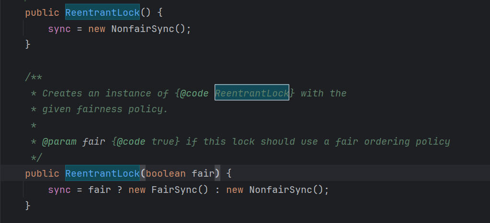

## ReentrantLock实现的原理

ReentrantLock翻译过来是可重入锁。

ReentrantLock主要利用CAS+AQS队列来实现。它支持公平锁和非公平锁，两者的实现类似。

构造方法接受一个可选的公平参数（默认非公平锁），当设置为true时，表示公平锁，否则为非公平锁。公平锁的效率往往没有非公平锁的效率高，在许多线程访问的情况下，公平锁表现出较低的吞吐量。

查看ReentrantLock源码中的构造方法：

其中sync 是Sync类 继承了AQS接口。 NofairSync和FairSync 类继承了Sync类。

> 工作流程

- 线程来抢锁后使用cas的方式修改state状态，修改状态成功为1，则让exclusiveOwnerThread属性指向当前线程，获取锁成功。

- 假如修改状态失败，则会进入双向队列中等待，head指向双向队列头部，tail指向双向队列尾部。

- 当exclusiveOwnerThread为null的时候，则会唤醒在双向队列中等待的线程。

- 公平锁则体现在按照先后顺序获取锁，非公平体现在不在排队的线程也可以抢锁。