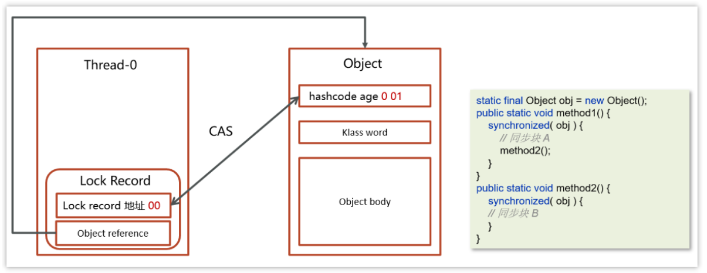

## synchronized关键字的底层原理？

synchronized的基本使用

```java
public class TicketDemo {

    static Object lock = new Object();
    int ticketNum = 10;


    public synchronized void getTicket() {
        synchronized (this) {
            if (ticketNum <= 0) {
                return;
            }
            System.out.println(Thread.currentThread().getName() + "抢到一张票,剩余:" + ticketNum);
            // 非原子性操作
            ticketNum--;
        }
    }

    public static void main(String[] args) {
        TicketDemo ticketDemo = new TicketDemo();
        for (int i = 0; i < 20; i++) {
            new Thread(() -> {
                ticketDemo.getTicket();
            }).start();
        }
    }
}
```

synchronized关键字的底层原理是什么？

底层核心就是monitor。

monitor 是jvm中的对象。是实现synchronized的关键。

具体来说，一下例子

```java
public class Mytest {

    static final Object lock = new Object();


    public static void main(String[] args) {

       synchronized(lock){
           System.out.println("111");
       }
    }
}
```

通过jdk提供的反编译工具 `javap -v SyncTest.class`


可以看出synchronized关键字的原理就是monitor的作用，`monitorenter`是加锁,`monitorexit`是解锁。为什么有两个`monitorexit`是因为synchronized隐式的使用的finally{},防止异常发生而不能解锁。

那么monitor是什么呢？Monitor 被翻译为监视器，是由jvm提供，c++语言实现。

在使用了synchornized代码块时需要指定一个对象，所以synchornized也被称为对象锁

monitor主要就是跟这个对象产生关联，如下图


Monitor内部具体的存储结构：

- Owner：存储当前获取锁的线程的，只能有一个线程可以获取
- EntryList：关联没有抢到锁的线程，处于Blocked状态的线程
- WaitSet：关联调用了wait方法的线程，处于Waiting状态的线程

具体的流程：

- 线程进入synchorized代码块，先让lock（对象锁）关联的monitor，然后判断Owner是否有线程持有
- 如果没有线程持有，则让当前线程持有，表示该线程获取锁成功
- 如果有线程持有，则让当前线程进入entryList进行阻塞，如果Owner持有的线程已经释放了锁，在EntryList中的线程去竞争锁的持有权（非公平）
- 如果代码块中调用了wait()方法，则会进去WaitSet中进行等待。


对象是怎么关联上的monitor？

这就要说一下对象的内存结构

在HotSpot虚拟机中，对象在内存中存储的布局可分为3块区域：对象头（Header）、实例数据（Instance Data）和对齐填充。


最重要的就是MarkWord


- hashcode：25位的对象标识Hash码
- age：对象分代年龄占4位
- biased_lock：偏向锁标识，占1位 ，0表示没有开始偏向锁，1表示开启了偏向锁
- thread：持有偏向锁的线程ID，占23位
- epoch：偏向时间戳，占2位
- ptr_to_lock_record：轻量级锁状态下，指向栈中锁记录的指针，占30位
- ptr_to_heavyweight_monitor：重量级锁状态下，指向对象监视器Monitor的指针，占30位

我们可以通过lock的标识，来判断是哪一种锁的等级

- 后三位是001表示无锁
- 后三位是101表示偏向锁
- 后两位是00表示轻量级锁
- 后两位是10表示重量级锁

如果使用 synchronized 给对象上锁（重量级）之后，**该对象头的Mark Word 中就被设置指向 Monitor 对象的指针**。


Monitor实现的锁属于重量级锁，你了解过锁升级吗？

- Monitor实现的锁属于重量级锁，里面涉及到了用户态和内核态的切换、进程的上下文切换，成本较高，性能比较低。

- 在JDK 1.6引入了两种新型锁机制：偏向锁和轻量级锁，它们的引入是为了解决在没有多线程竞争或基本没有竞争的场景下因使用传统锁机制带来的性能开销问题。

> 轻量级锁

在很多的情况下，在Java程序运行时，同步块中的代码都是不存在竞争的，不同的线程交替的执行同步块中的代码。这种情况下，用重量级锁是没必要的。因此JVM引入了轻量级锁的概念。

```java
static final Object obj = new Object();

public static void method1() {
    synchronized (obj) {
        // 同步块 A
        method2();
    }
}

public static void method2() {
    synchronized (obj) {
        // 同步块 B
    }
}
```

**加锁的流程**

1.在线程栈中创建一个Lock Record，将其obj字段指向锁对象。


2.通过CAS指令将Lock Record的地址存储在对象头的mark word中（数据进行交换），如果对象处于无锁状态则修改成功，代表该线程获得了轻量级锁。


3.如果是当前线程已经持有该锁了，代表这是一次锁重入。设置Lock Record第一部分为null，起到了一个重入计数器的作用。


4.如果CAS修改失败，说明发生了竞争，需要升级为重量级锁。

**解锁过程**

1.遍历线程栈,找到所有obj字段等于当前锁对象的Lock Record。

2.如果Lock Record的Mark Word为null，代表这是一次重入，将obj设置为null后continue。


3.如果Lock Record的 Mark Word不为null，则利用CAS指令将对象头的mark word恢复成为无锁状态。如果失败则膨胀为重量级锁。



> 偏向锁

就一个线程使用，只有第一次使用 CAS 将**线程 ID** 设置到对象的 Mark Word 头，之后发现

这个线程 ID 是自己的就表示没有竞争，不用重新 CAS。以后只要不发生竞争，这个对象就归该线程所有

**加锁的流程**

1.在线程栈中创建一个Lock Record，将其obj字段指向锁对象。


2.通过CAS指令将Lock Record的**线程id**存储在对象头的mark word中，同时也设置偏向锁的标识为101，如果对象处于无锁状态则修改成功，代表该线程获得了偏向锁。


3.如果是当前线程已经持有该锁了，代表这是一次锁重入。设置Lock Record第一部分为null，起到了一个重入计数器的作用。与轻量级锁不同的时，这里不会再次进行cas操作，只是判断对象头中的线程id是否是自己，因为缺少了cas操作，性能相对轻量级锁更好一些

