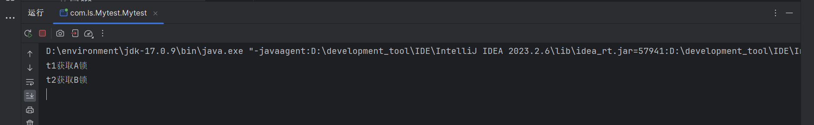

## 死锁产生的原因以及排查

死锁产生的原因是：两个线程或多个线程争夺临界资源的情况，而一直获取不到资源，这种情况是死锁。具体原因是一个线程获得了临界资源因为还需要其他资源目前无法执行完成，而一直占有临界资源，导致别的线程请求该临界资源不被允许，一直死锁。

```java
public class Mytest {

    static final Object A =new Object();
    static  final Object B =new Object();

    public static void main(String[] args) {
        new Thread(()-> {
            synchronized (A) {
                System.out.println(Thread.currentThread().getName() + "获取A锁");
                try {
                    sleep(500);
                } catch (InterruptedException e) {
                    throw new RuntimeException(e);
                }
                synchronized (B) {
                    System.out.println(Thread.currentThread().getName() + "获取B锁");
                }
            }
        },"t1").start();

        new Thread(()-> {
            synchronized (B) {
                System.out.println(Thread.currentThread().getName() + "获取B锁");
                try {
                    sleep(500);
                } catch (InterruptedException e) {
                    throw new RuntimeException(e);
                }
                synchronized (A) {
                    System.out.println(Thread.currentThread().getName() + "获取A锁");
                }
            }
        },"t2").start();

    }
}
```



可以看出程序还在执行。

> 那么怎么排查死锁的线程呢？

如果逻辑简单，就需要理获取锁的线程，是否可能会导致死锁。

还可以使用JDK提供的工具 jps 和jstack

jps: 列出jvm中进程的执行，列出进程的标识和进行id

jstack：jstack <PID>，列出该进程的详细信息

