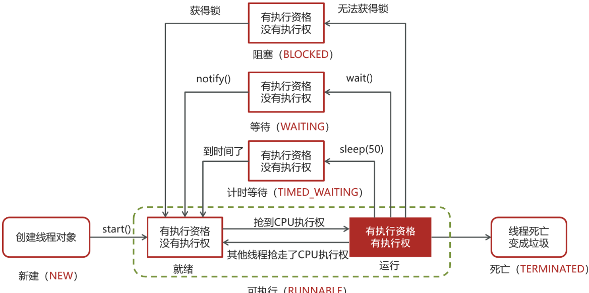

## 线程包括哪些状态，状态之间是如何变化的

参考Thread类中的枚举

```java
public enum State {
        /**
         * 尚未启动的线程的线程状态
         */
        NEW,

        /**
         * 可运行线程的线程状态。处于可运行状态的线程正在 Java 虚拟机中执行，但它可能正在等待来自		 * 操作系统的其他资源，例如处理器。
         */
        RUNNABLE,

        /**
         * 线程阻塞等待监视器锁的线程状态。处于阻塞状态的线程正在等待监视器锁进入同步块/方法或在调          * 用Object.wait后重新进入同步块/方法。
         */
        BLOCKED,

        /**
         * 等待线程的线程状态。由于调用以下方法之一，线程处于等待状态：
		* Object.wait没有超时
         * 没有超时的Thread.join
         * LockSupport.park
         * 处于等待状态的线程正在等待另一个线程执行特定操作。
         * 例如，一个对对象调用Object.wait()的线程正在等待另一个线程对该对象调用Object.notify()			* 或Object.notifyAll() 。已调用Thread.join()的线程正在等待指定线程终止。
         */
        WAITING,

        /**
         * 具有指定等待时间的等待线程的线程状态。由于以指定的正等待时间调用以下方法之一，线程处于定          * 时等待状态：
		* Thread.sleep
		* Object.wait超时
		* Thread.join超时
		* LockSupport.parkNanos
		* LockSupport.parkUntil
         * </ul>
         */
        TIMED_WAITING,

        /**
         * 已终止线程的线程状态。线程已完成执行
         */
        TERMINATED;
    }
```

状态之间是如何变化的

