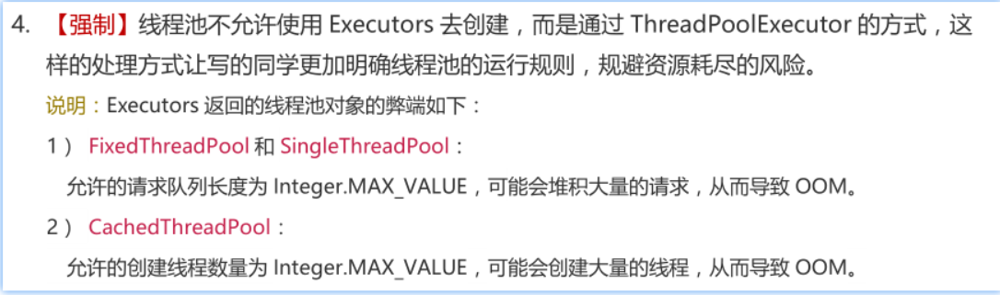

## 线程池的种类有哪些?

线程的创建和关闭会消耗大量的资源，同时业务如果需要很多线程，我们创建很多线程，但是单核cpu一次只能执行一个线程，创建大量的线程会消耗资源，而且还得不到cpu的控制权，所以业务中都是选择线程池。

在java.util.concurrent.Executors类中提供了大量创建连接池的静态方法，常见就有四种

> newFixedThreadPool 创建使用固定线程数的线程池

使用

```java

public class Mytest {

    static class FixedThreadDemo implements Runnable{
        @Override
        public void run() {
            String name = Thread.currentThread().getName();
            for (int i = 0; i < 2; i++) {
                System.out.println(name + ":" + i);
            }
        }
    }

    public static void main(String[] args) throws InterruptedException {

        ExecutorService executorService = Executors.newFixedThreadPool(5);

        for (int i = 0; i < 5; i++) {
            executorService.execute(new FixedThreadDemo());
            sleep(10);

        }
        executorService.shutdown();

        System.out.println("Author:hnsqls");
    }
}
```

源码

```java
 public static ExecutorService newFixedThreadPool(int nThreads) {
        return new ThreadPoolExecutor(nThreads, nThreads,
                                      0L, TimeUnit.MILLISECONDS,
                                      new LinkedBlockingQueue<Runnable>());
    }
```

解释： 只有核心线程数，没有临时线程，阻塞队列是LinkedBlockingQueue,并且没有指定阻塞队列空间，那么默认是Integer.Value_MAX。 拒绝策略是默认策略，直接抛出异常。


> newSingleThreadExecutor 单线程化的线程池	

```
ExecutorService executorService = Executors.newSingleThreadExecutor();
```

源码

```java
    /**
     * Creates an Executor that uses a single worker thread operating
     * off an unbounded queue. (Note however that if this single
     * thread terminates due to a failure during execution prior to
     * shutdown, a new one will take its place if needed to execute
     * subsequent tasks.)  Tasks are guaranteed to execute
     * sequentially, and no more than one task will be active at any
     * given time. Unlike the otherwise equivalent
     * {@code newFixedThreadPool(1)} the returned executor is
     * guaranteed not to be reconfigurable to use additional threads.
     *
     * @return the newly created single-threaded Executor
     */
    public static ExecutorService newSingleThreadExecutor() {
        return new FinalizableDelegatedExecutorService
            (new ThreadPoolExecutor(1, 1,
                                    0L, TimeUnit.MILLISECONDS,
                                    new LinkedBlockingQueue<Runnable>()));
    }
```

解释： 核心线程数1,最大线程为1，阻塞队列是LinkedBlockingQueue且没指定空间。拒绝策略为默认策略。


> newCachedThreadPool 可缓存线程池

源码

```java
    /**
     * Creates a thread pool that creates new threads as needed, but
     * will reuse previously constructed threads when they are
     * available.  These pools will typically improve the performance
     * of programs that execute many short-lived asynchronous tasks.
     * Calls to {@code execute} will reuse previously constructed
     * threads if available. If no existing thread is available, a new
     * thread will be created and added to the pool. Threads that have
     * not been used for sixty seconds are terminated and removed from
     * the cache. Thus, a pool that remains idle for long enough will
     * not consume any resources. Note that pools with similar
     * properties but different details (for example, timeout parameters)
     * may be created using {@link ThreadPoolExecutor} constructors.
     *
     * @return the newly created thread pool
     */
    public static ExecutorService newCachedThreadPool() {
        return new ThreadPoolExecutor(0, Integer.MAX_VALUE,
                                      60L, TimeUnit.SECONDS,
                                      new SynchronousQueue<Runnable>());
    }
```

解释

核心线程为0，最大线程数为MAX_Value.

阻塞队列是SychronousQueue:不存储元素的阻塞队列，每个插入操作都必须等待一个移出操作。

> ScheduledThreadPoolExecutor   提供了“延迟”和“周期执行”功能的ThreadPoolExecutor。

源码

```java
    /**
     * Creates a new {@code ScheduledThreadPoolExecutor} with the
     * given core pool size.
     *
     * @param corePoolSize the number of threads to keep in the pool, even
     *        if they are idle, unless {@code allowCoreThreadTimeOut} is set
     * @throws IllegalArgumentException if {@code corePoolSize < 0}
     */
    public ScheduledThreadPoolExecutor(int corePoolSize) {
        super(corePoolSize, Integer.MAX_VALUE,
              DEFAULT_KEEPALIVE_MILLIS, MILLISECONDS,
              new DelayedWorkQueue());
    }
```

解释

核心线程数自定义，最大线程数max_value

阻塞队列 DelayedWorkQueue。

> 扩展 不建议使用Executors创建线程池


阿里开发手册

