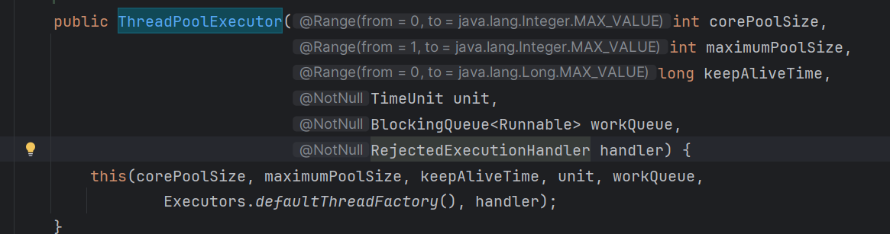
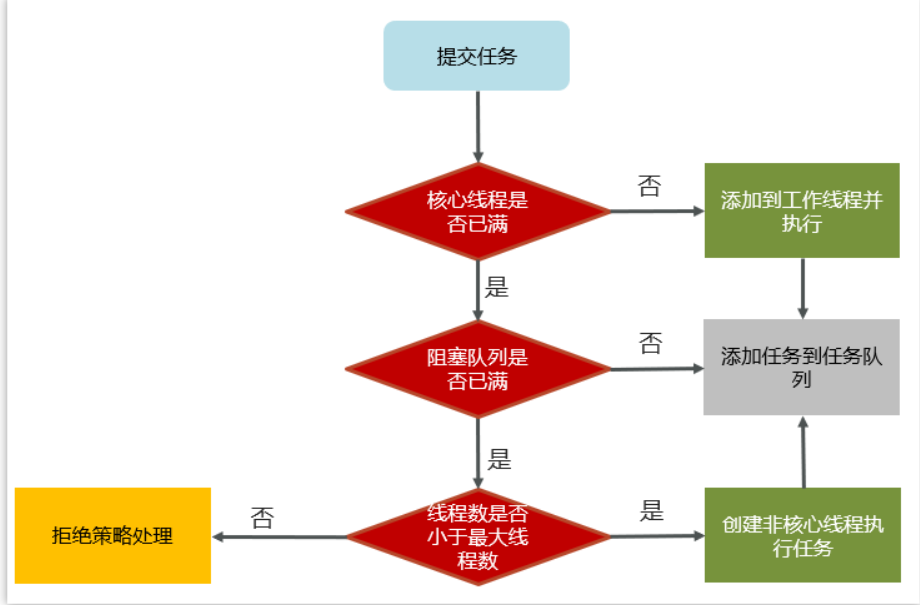

## 线程池的核心参数以及执行原理

参考ThreadPoolExecutor

- corePoolSize 核心线程数目
- maximumPoolSize 最大线程数目 = (核心线程+救急线程的最大数目)
- keepAliveTime 生存时间 - 救急线程的生存时间，生存时间内没有新任务，此线程资源会释放
- unit 时间单位 - 救急线程的生存时间单位，如秒、毫秒等
- workQueue - 当没有空闲核心线程时，新来任务会加入到此队列排队，队列满会创建救急线程执行任务
- threadFactory 线程工厂 - 可以定制线程对象的创建，例如设置线程名字、是否是守护线程等
- handler 拒绝策略 - 当所有线程都在繁忙，workQueue 也放满时，会触发拒绝策略

> 工作流程

1，任务在提交的时候，首先判断核心线程数是否已满，如果没有满则直接添加到工作线程执行

2，如果核心线程数满了，则判断阻塞队列是否已满，如果没有满，当前任务存入阻塞队列

3，如果阻塞队列也满了，则判断线程数是否小于最大线程数，如果满足条件，则使用临时线程执行任务

如果核心或临时线程执行完成任务后会检查阻塞队列中是否有需要执行的线程，如果有，则使用非核心线程执行任务

4，如果所有线程都在忙着（核心线程+临时线程），则走拒绝策略