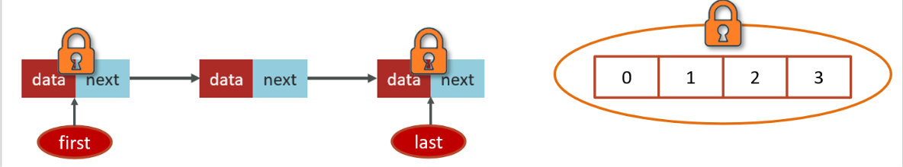

## 阻塞队列都有那些?

workQueue - 当没有空闲核心线程时，新来任务会加入到此队列排队，队列满会创建救急线程执行任务

比较常见的有4个，用的最多是ArrayBlockingQueue和LinkedBlockingQueue

1.ArrayBlockingQueue：基于数组结构的有界阻塞队列，FIFO。

2.LinkedBlockingQueue：基于链表结构的有界阻塞队列，FIFO。

3.DelayedWorkQueue ：是一个优先级队列，它可以保证每次出队的任务都是当前队列中执行时间最靠前的

4.SynchronousQueue：不存储元素的阻塞队列，每个插入操作都必须等待一个移出操作。

**ArrayBlockingQueue的LinkedBlockingQueue区别**

> **ArrayBlockingQueue**

要指定容量大小。

```java
 ArrayBlockingQueue<Runnable> arrayBlockingQueue = new ArrayBlockingQueue<>(10);
```


> LinkedBlockingQueue

可以不指定大小（不推荐），默认Integer.MAX_VALUE

```java
  LinkedBlockingQueue<Runnable> linkedBlockingQueue = new LinkedBlockingQueue<>(10);
```

```java
    /**
     * Creates a {@code LinkedBlockingQueue} with a capacity of
     * {@link Integer#MAX_VALUE}.
     */
    public LinkedBlockingQueue() {
        this(Integer.MAX_VALUE);
    }
```

| **LinkedBlockingQueue**          | **ArrayBlockingQueue** |
| -------------------------------- | ---------------------- |
| 默认无界，支持有界               | 强制有界               |
| 底层是链表                       | 底层是数组             |
| 是懒惰的，创建节点的时候添加数据 | 提前初始化 Node  数组  |
| 入队会生成新 Node                | Node需要是提前创建好的 |
| 两把锁（头尾）                   | 一把锁                 |

左边是LinkedBlockingQueue加锁的方式，右边是ArrayBlockingQueue加锁的方式

- LinkedBlockingQueue读和写各有一把锁，性能相对较好
- ArrayBlockingQueue只有一把锁，读和写公用，性能相对于LinkedBlockingQueue差一些。

