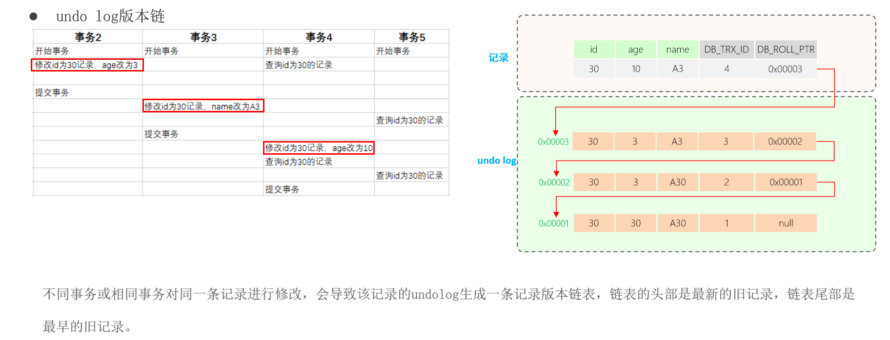

## MVCC 是什么？

​	MVCC 的意思是多版本并发控制。指维护一个数据的多个版本，使得读写操作没有冲突。

​	它的底层实现主要是分为了三个部分，第一个是隐藏字段，第二个是undo log日志，第三个是readView读视图。

> 隐藏字段

* DB_TRX_ID ：最近修改事务ID，记录插入这条记录或最后一次修改该记录的事务ID。
* DB_ROLL_PTR：回滚指针，指向这条记录的上一个版本，用于配合undo log，指向上一个版本。
* DB_ROW_ID：隐藏主键，如果表结构没有指定主键，将会生成该隐藏字段。

> undo log 日志  

回滚日志，在insert、update、delete的时候产生的便于数据回滚的日志。
当insert的时候，产生的undo log日志只在回滚时需要，在事务提交后，可被立即删除。
而update、delete的时候，产生的undo log日志不仅在回滚时需要，mvcc版本访问也需要，不会立即被删除。

在多个事务对一条记录修改的情况况下，undolog日志记录了版本链。

> ReadView 读视图

ReadView（读视图）是 **快照读** SQL执行时MVCC提取数据的依据，记录并维护系统当前活跃的事务（未提交的）id。

* 当前读 ：读取的是记录的最新版本，读取时还要保证其他并发事务不能修改当前记录，会对读取的记录进行加锁。对于我们日常的操作，如：select ... lock in share mode(共享锁)，select ... for update、update、insert、delete(排他锁)都是一种当前读。
* 快照读：简单的select（不加锁）就是快照读，快照读，读取的是记录数据的可见版本，有可能是历史数据，不加锁，是非阻塞读。

ReadView的四个核心字段

* m_ids : 当前活跃的事务ID集合
* min_trx_id : 最小活跃事务ID
* max_trx_id : 预分配事务ID，当前最大事务ID+1（因为事务ID是自增的）
* creator_trx_id : ReadView创建者的事务ID

版本链数据的访问规则

不同的隔离级别，产生ReadView的时机不同。

* Read Committed：每次select，都生成一个快照读。
* Repeatable Read：开启事务后第一个select语句才是快照读的地方。