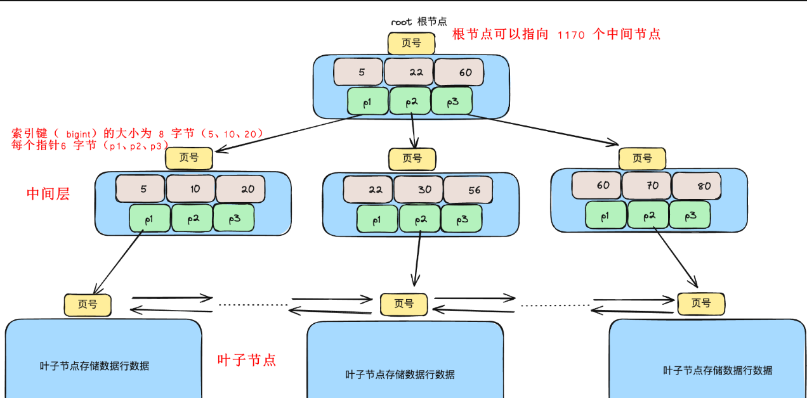

## Mysql 三层B+树能存多少数据

要计算三层B+能存储多少数据，要清楚几个数据，数据页大小，索引值大小，指针大小，数据行大小。

Mysql数据存储的基本单位是页。默认大小是16kb。

```sql
show global status like 'innodb_page_size';
```

| Variable_name    | Value |
| ---------------- | ----- |
| innodb_page_size | 16384 |

* 16KB  = 16 * 1024 = 16384 字节

假设 数据行大小为 1Kb，索引大小8字节（bigint）指针6字节。

第一层 B+ 树 只存储指针和索引值所以第一层的结点 16384 / （8 + 6） = 1170

第二层 B+ 树 在第一层1170 的节点上再分  即 1170 *1170 = 1,368,900

第三层 B+ 树 存储数据行，1368900*16kb / 1kb = 21,902,400

大概可以存2000w条数据。

数据结构大概这样

