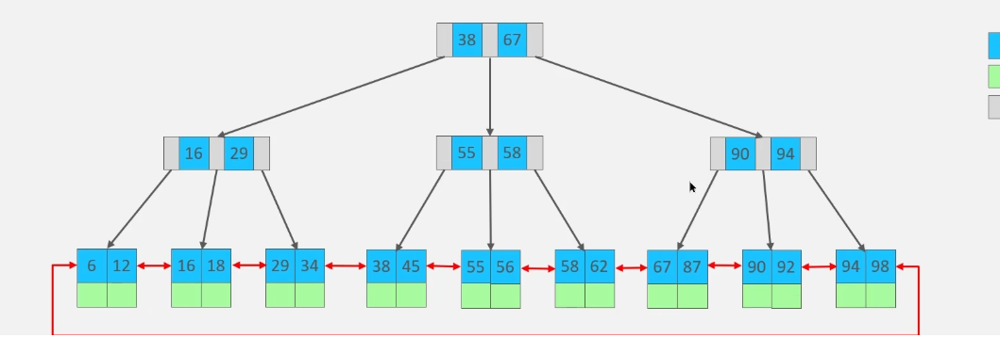

## Mysql 为什么选择为使用B+ 树作为数据结构

索引是为了高效获取数据的一种数据结构。

选择B + 树的原因有以下三点

* 查询效率稳定： 相较于二叉树而言，二叉树的最坏情况查询效率是O(N),而B+树是一种自平衡树，每个叶子节点到根节点的距离相同。查找效率O(log(N))。
* 树的高度不会增长过快，磁盘IO少：B+树是多叉树，不像红黑树数据越多高度增长越快；并且相较于B树比较，B+树的非叶子节点只存储页指针和索引值，所以相同页大小可以存更多的索引，使得磁盘IO减少。
* 范围查询快：B+树的叶子节点维护了一个双向链表。B+树在进行范围查询的时候，会根据索引先找到第一个元素，然后根据链表依次获取范围内的元素。

