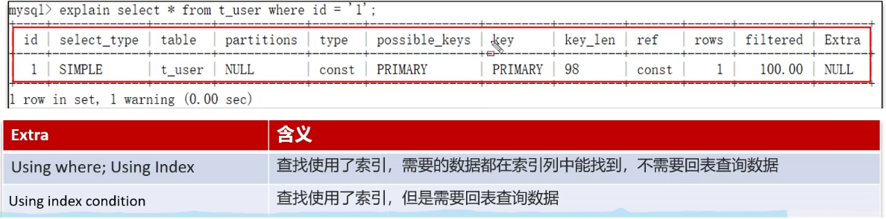

## Mysql 如何分析慢sql

我们通常会使用mysql自动的执行计划explain来去查看这条sql的执行情况。

首先如果本身已经添加了索引，查看key和key_len是否命中了索引，判断索引是否失效，如果失效就排查失效的原因。

其次可以通过type字段查看sql是否有进一步的优化空间，是否存在全索引扫描或全盘扫描。

还可以通过extra建议来判断，是否出现了回表的情况，如果出现了，可以尝试添加索引或修改返回字段来修复。

如下分析的字段

type字段的标识sql的性能(由高到低)

* system ： 查系统表
* const ：查询的表只有一个匹配结果，通常就是主键或唯一索引查询，并且是常量。
* eq_ref：使用唯一索引查找单个匹配的行。因为索引是唯一的，所以优化器可以确定最多只有一个匹配的行。
* ref ：使用非唯一索引或前缀索引来查找单个匹配的行。这通常发生在连接操作中，其中一个表的列与另一个表的索引列相关联。
* range：使用索引来检索给定范围内的行。例如，使用`BETWEEN`、`<`、`>`、`<=`、`>=`等条件时。这种访问方式通常比全索引扫描更高效，因为它只扫描索引的一部分。
* index：表示通过遍历整个索引来查找匹配的行。这通常比全表扫描要快，因为索引通常比表数据小。
* all ：表示进行全表扫描来找到匹配的行。通常，这种访问方式效率较低，尤其是当表数据量很大时。

