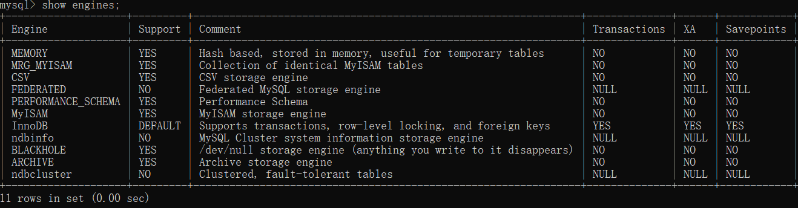

## Mysql存储引擎

mysql 支持的存储引擎很多可以查看。

```sql 
show engines
```



上表的解释

+ **Engine**: 存储引擎的名称。
+ **Support**: 表示该存储引擎是否被MySQL支持（YES）或不支持（NO）。某些存储引擎可能因为特定版本的MySQL或特定的配置而不被支持。
+ **Comment**: 对存储引擎的简短描述，解释了它的基本特性和用途。
+ **Transactions**: 表示该存储引擎是否支持事务（YES）或不支持（NO）。事务是数据库操作的一个逻辑单元，它可以确保一系列操作的原子性、一致性、隔离性和持久性（ACID属性）。
+ **XA**: 表示该存储引擎是否支持XA（eXtended Architecture）事务，这是一种分布式事务的规范，允许跨多个资源（如数据库）执行事务。
+ **Savepoints**: 表示该存储引擎是否支持保存点（YES）或不支持（NO）。保存点允许在事务中设置一个点，可以回滚到这个点而不必回滚整个事务。

主要了解这三个引擎
一、InnoDB

1. **特点**
   + 支持事务：InnoDB提供了具有提交、回滚和崩溃恢复能力的事务安全，即ACID（原子性、一致性、隔离性、持久性）兼容的事务支持。
   + 行级锁定：InnoDB支持行级锁定，避免了对整个表或大部分表的加锁，提高了并发性能。
   + 索引数据结构： 底层是B+树，快速查找数据，降低磁盘IO(只在叶子节点存储数据)，范围查询（叶子节点存储的数据维护一个双向列表）
   + 外键约束：InnoDB支持外键约束，确保了数据的完整性和一致性。
   + 缓冲池：InnoDB拥有自己的缓冲池，用于在主内存中缓存数据和索引，提高了查询和写入速度。
   + 崩溃恢复：InnoDB通过redolog来保证崩溃后的数据恢复，当数据库异常崩溃后，重新启动时会根据redolog进行数据恢复，保证数据库恢复到崩溃前的状态。
2. **适用场景**
   + 适用于需要高事务完整性和并发性能的应用场景，如电子商务网站、金融系统等。

 二、MyISAM

1. **特点**
   + 不支持事务：MyISAM不支持事务处理和崩溃恢复功能，因此不适用于需要高事务完整性的应用场景。
   + 表级锁定：MyISAM只支持表级锁定，并发性能较差，同时读操作会阻塞写操作，写操作也会阻塞读操作（但读操作之间不会相互阻塞）。
   + 索引数据结构：和innodb一样采用了基于B+树的索引机制，但是在叶子节点存储的数据只是索引的值而非整行数据。
   + 占用空间较小：MyISAM对数据的压缩和文件大小的管理相对简单，因此在数据管理方面能够占用较小的存储空间。
   + 全文索引：MyISAM支持全文索引，适用于需要全文搜索的应用场景。
2. **适用场景**
   + 适用于读操作远远多于写操作的场景，如数据仓库、日志记录等。

三、MEMORY

1. **特点**
   + 数据存储在内存中：MEMORY存储引擎将数据存储在内存中，因此读写速度非常快。
   + 不支持持久化存储：当MySQL服务器关闭或重启时，MEMORY引擎中的数据将丢失，因此不适用于需要长期保存数据的应用场景。
   + 支持哈希索引：可以快速查询数据，但是不能范围查询。
   + 表级锁定：MEMORY引擎使用表级锁定，可能导致并发性能问题。
   + 受限于可用内存大小：由于数据存储在内存中，因此受限于可用的内存大小，如果表过大，可能无法完全缓存在内存中，导致性能下降。
2. **适用场景**
   + 适用于临时表、缓存表和高性能临时存储，如缓存数据等。
