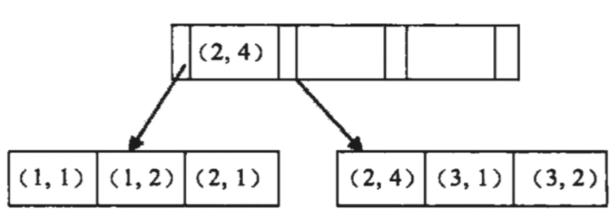

## Mysql 最左匹配原则

Mysql 的最左匹配原则是指在使用联合索引时，查询条件必须从最左侧匹配，依次向右匹配。违反这个规则就会导致索引失效。

原因：因为联合索引的创建是从左到右有序的创建。

比如，创建（a,b）联合索引，查询条件是where a = 1,;where a = 1 and b = 2;都可以正常使用索引。但是where b  = 2 就索引失效。

联合索引的结构




遇到范围查询<,> 就会导致后面的索引失效。

```sql
where a > 1, b = 2;	
```

原因：a先经过范围查询 查找到第一个大于a > 2 的元素，然后根据双向链表获得其他a>2的元素，获取的数据b不是有序的，所以要全部遍历判断一下b是否等于2。所以就导致了索引失效。

但是使用 >= , <= 索引 索引不失效

```sql
where a>=1,b = 2;
```

原因： a = 1,b = 2 可以。使用索引查到这个数据，其他的a >1,b = 2 的数据由于在a不相等的情况下，b是无序的，所以还只能走（a）索引，而不是（a,b）索引。


