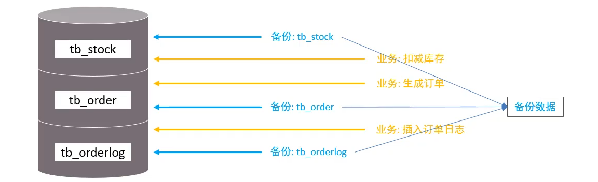

## Mysql的锁机制

> 全局锁 

对整个数据库加锁，只允许事务的读操作，写操作会处于等待状态

```sql
flush tables with read lock; # 加锁
unlock tables;  # 解锁，或者推出终端也会解锁
```

使用场景： 数据备份



如果不加锁，就会出现数据不一致问题。因为在备份的时候，有业务导致数据库在备份的过程中发生变化，导致备份后数据不一致。

如何备份操作呢？

首先进入mysql 终端加锁

```sql
flush tables with read lock; # 加锁
```

新开一个mysql命令行，尝试修改数据，发现修改不了，一直阻塞状态。直到释放全局锁。


然后用mysql提供的工具 mysqldump(主语不是sql语句，直接在我们的电脑终端执行即可)

```shell
C:\Users\26611>mysqldump -uroot -p studb > d:/studb.sql
Enter password: ****
```


缺点： 1. 对整个数据库加锁，数据库只能读，那么业务就不能写，会造成业务停滞。

​			 2.对从库备份，使用全局锁，会导致在使用全局锁时，导致binlog日志文件不能写，会导致延迟。 

使用全局锁，会影响业务写操作，那么怎么解决呢？

有些数据库引擎(Innodb)支持可重复读的事务隔离级别，在备份前开启事务会创建 Read View，备份期间业务仍可更新数据。可重复读下，即使其他事务更新，备份的 Read View 不受影响，确保了数据的一致性。使用 mysqldump 备份时，可加 –single-transaction 参数以适应支持此隔离级别的引擎，如 InnoDB。对于 MyISAM 这种不支持事务的引擎，备份时需使用全局锁。


> 表级锁

对表加锁，表锁，元数据锁，意向锁，


共享锁（Read Lock）的使用

```sql
use studb # 选择数据库
lock tables students read;  # 对表加共享锁锁
unlock tables；    # 解锁
```

共享锁，对表加共享锁，允许所有的事务可以读表，但是不能进行写操作；加锁的mysql终端，进行写操作，会报错，其他mysql终端写操作会阻塞。

排他锁（Write Lock） 的使用

```sql
use studb # 选择数据库
lock tables students  write; # 对标加排他锁
unlock tables; # 解锁
```

排他锁，对表加排他锁，只有拿到排他锁的事务才可以对标读，写操作，其他事务会阻塞，直到释放锁（unlock tables 或者关闭加锁的终端）。


同时对表加共享锁和排他锁后，加锁的mysql终端不能对其他表操作。如下

```shell
mysql> lock tables students read;
Query OK, 0 rows affected (0.00 sec)

mysql> select * from test;
ERROR 1100 (HY000): Table 'test' was not locked with LOCK TABLES
```


> 元数据锁

​	元数据锁主要用于保护数据库对象的结构，在并发环境下确保数据的一致性。当一个事务试图修改数据库的结构（如通过`ALTER TABLE`命令添加或删除列）时，它需要先获得相应对象的元数据锁。这种锁确保了在表结构被修改的同时，不会有其他事务尝试访问或修改该表的结构，从而避免数据不一致或错误。


> 意向锁

意向锁（Intention Lock）是数据库中一种重要的锁机制，主要用于解决行级锁和表级锁之间的冲突，提高数据库的并发性和性能.

意向锁是一种表级别的锁，用于表明当前事务计划在表中的某些行上设置更精细的锁（如行级锁）。它的主要目的是协调行锁和表锁之间的关系，避免锁冲突，从而提高数据库的并发性能。怎么理解呢？

在进行update 操作时会自动加上行级锁，然后其他事务对这个表加表锁，会扫描每一行检查行锁的类型，判断释放能加上表锁。但是有了意向锁之后，进行update 操作（行锁），会在表上加一个意向锁（IS和IX）,其他事务在加表锁直接和意向锁比较判断是否能加锁。

1. **意向共享锁（IS Lock）**：
   + 当事务打算对某一行加共享锁时，它首先在表级加一个意向共享锁。
   + 意向共享锁允许多个事务在表级别并发地读取数据，但不允许修改数据。
2. **意向排他锁（IX Lock）**：
   + 当事务打算对某一行加排他锁时，它首先在表级加一个意向排他锁。
   + 意向排他锁意味着事务将在行级上加排他锁，其他事务不能在该行上加意向共享锁或意向排他锁。

**意向共享锁与共享锁可以兼容，而意向排他锁与排他锁是互斥的。**


> 行锁

1. **Record Lock（记录锁）**：单独在记录上加锁，适合如主键记录更新等场景。

   + 当一个事务对一条记录加了 S 型记录锁后，其他事务也可以继续对该记录加 S 型记录锁（S 型与 S 锁兼容），但是不可以对该记录加 X 型记录锁（S 型与 X 锁不兼容）；
   + 当一个事务对一条记录加了 X 型记录锁后，其他事务既不可以对该记录加 S 型记录锁（S 型与 X 锁不兼容），也不可以对该记录加 X 型记录锁（X 型与 X 锁不兼容）。

   举个例子，当一个事务执行了下面这条语句：

   ```sql
    mysql > begin; 
    mysql > select * from t_test where id = 1 for update;
   ```

   就是对 t_test 表中主键 id 为 1 的这条记录加上 X 型的记录锁，这样其他事务就无法对这条记录进行修改了。

   当事务执行 commit 后，事务过程中生成的锁都会被释放。

   

1. **Gap Lock（间隙锁）**：Gap Lock 称为间隙锁，只存在于可重复读隔离级别，目的是为了解决可重复读隔离级别下幻读的现象。假设，表中有一个范围 id 为（3，5）间隙锁，那么其他事务就无法插入 id = 4 这条记录了，这样就有效的防止幻读现象的发生.


1. **Next-Key Lock（临键锁）**：Next-Key Lock 称为临键锁，是 Record Lock + Gap Lock 的组合，锁定一个范围，并且锁定记录本身。，锁定一个范围，并且锁定记录本身。也不能修改 id = 5 这条记录。所以，next-key lock 即能保护该记录，又能阻止其他事务将新纪录插入到被保护记录前面的间隙中。

