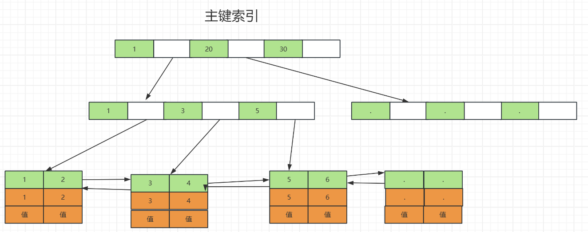
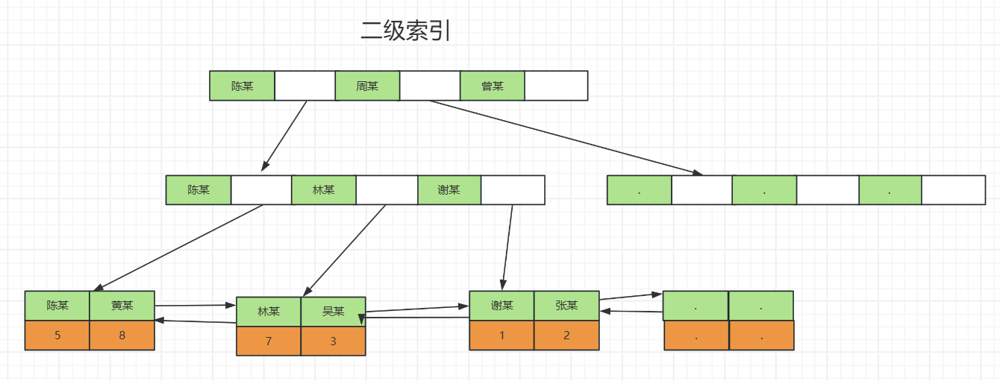
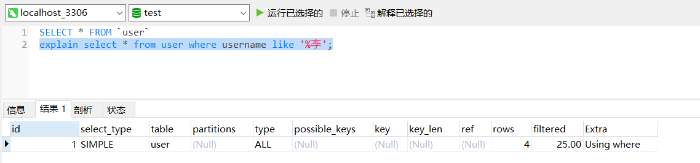
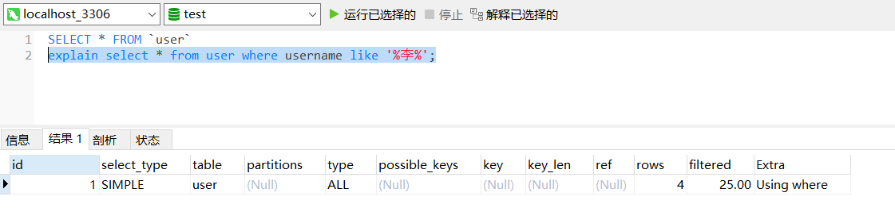
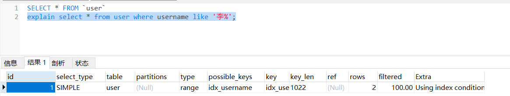
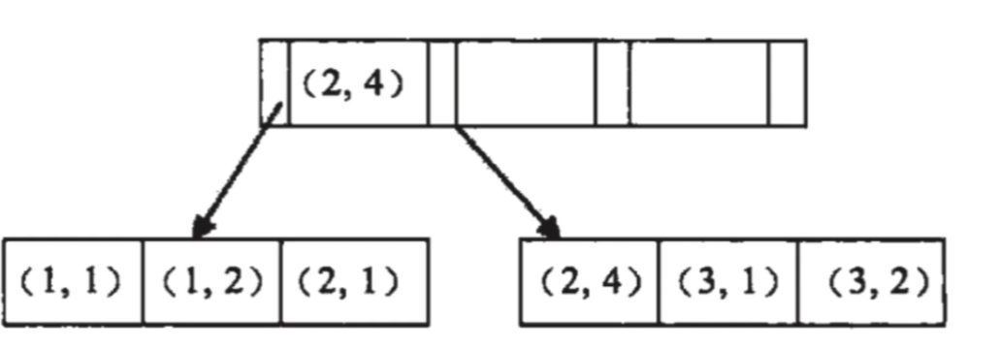

## Mysql索引失效的场景以及原理

有以下表

```sql
CREATE TABLE `user` (
  `id` int NOT NULL AUTO_INCREMENT,
  `username` varchar(255) NOT NULL,
  `age` int NOT NULL,
  `phone` varchar(50) NOT NULL,
  PRIMARY KEY (`id`),
  KEY `idx_username` (`username`),
  KEY `idx_phone` (`phone`)
) ENGINE=InnoDB DEFAULT CHARSET=utf8mb4 COLLATE=utf8mb4_0900_ai_ci; 
```

>  主键索引 id



索引的叶子节点存整行的数据。

> 二级索引 username



二级索引的叶子节点存的值是主键的值。若使用二级索引查找，就只能找到该索引本身的值以及该数据的主键的值，若需要该行数据的其他数据，就会根据获得的主键值再去查找，也叫回表。


> 索引失效的场景

1. 使用模糊匹配

```sql
select * from user where username like '%李'
select * from user where username like '%李%'
select * from user where username like '李%' # 这个可以正常使用索引
```

可以使用explain 分析以上sql



_____________________________________________________





__________________



为什么使用左模糊匹配会导致索引失效呢？

结合索引的结构就很容易想明白。索引的构建是先根据索引字段的值排序的，对于字符类型是字典序排序。要首先判断前面的字，才能够有序查找，而左模糊匹配找的是最后一个字匹配，索引就不能够使用索引找，而是全局扫描了一遍。

2. 对索引字使用函数

```sql
select *from user where length(username) = 6;
```

失效的原因是：索引保存的索引字段的初始值，而不是经过函数计算后的值，自然就没法走索引。

3. 对索引进行表达式计算

```sql
select * from user where id + 1 = 10;
```

失效的原因：索引保存的索引字段的值，而不是id+1后的值，所以无法走索引。

4. 对索引隐式的类型转换

```sql
# phone 是 vachar类型
select * from user where phone = 123456789;  # 不走索引
select * from user where phone = '123456789'; # 走索引
```

失效的原因，mysql看到参数是整形数字，将phone改为int 类型。相当于

```sql
select * from user where CAST(phone AS signed int) = 123456789
```

索引构建存的是字符串类型，查询的时候将索引的类型变了。

5. 联合索引违反最左匹配原则

   联合索引，索引的构建是先根据左边的索引排序，在根据右边的索引排序。

   比如，创建（a,b）联合索引，查询条件是where a = 1,;where a = 1 and b = 2;都可以正常使用索引。但是where b  = 2 就索引失效。

   联合索引的结构



失效的原理：索引的构建是从左到右排序构建索引，不按照最左匹配原则查询，查询的条件就是无序了，也就无法走索引。


总的来说，索引失效的原理，都是通过条件无法二分查询值，就只能走全表扫描。判断索引是否失效不仅仅要要求我们编写sql的时候注意导致索引失效的sql的编写，还要使用explain查看sql的执行情况。