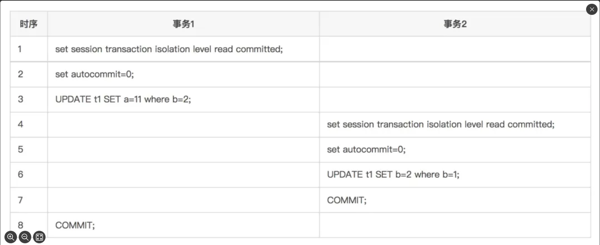

## Mysql 默认的隔离级别为什么是RR

首先，我们先从四种隔离级别中排除Serializable和Read Uncommitted这两种，主要是因为这两个级别一个隔离级别太高，一个太低。太高的就会影响并发度，太低的就有脏读现象。

RR 和 RC 的选择

在MySQL设计之处，他的定位就是提供一个稳定的关系型数据库。而为了要解决MySQL单点故障带来的问题，MySQL采用主从复制的机制。为了保证主从服务器之间的数据的一致性，就需要进行**数据同步**，大致的同步过程如下，简单理解就是主服务器把数据变更记录到bin log中，然后再把bin log同步传输给从服务器，从服务器接收到bin log之后，再把其中的数据恢复到自己的数据库存储中。

MySQL的bin log主要支持三种格式，分别是statement、row以及mixed。MySQL是在5.1.5版本开始支持row的、在5.1.8版本中开始支持mixed。

* statement： 这是MySQL最早支持的binlog格式。录的是SQL语句的原文。
  * 优点：日志记录量相对较小，可以节约磁盘及网络IO，提升性能。 主从版本可以不一样，从服务器版本可以比主服务器版本高。
  * 缺点： 可能导致主从同步的数据不一致问题。例如，使用DELETE或UPDATE时指定了LIMIT但没有使用ORDER BY，那么最终这条语句在主库和从库上的执行结果可能不一样。对于包含不确定操作或特定函数的SQL语句（如LOAD_FILE()、UUID()、USER()、FOUND_ROWS()、SYSDATE()等），可能无法被正确复制。
* MySQL从5.1.5版本开始支持row格式的binlog。记录每个数据更改的具体行的细节，即二进制日志中的每个条目都会详细列出发生变更的行的内容和修改。
  * 优点： 可以避免MySQL复制中出现主从不一致的问题；对每一行数据的修改比Statement模式高效。在误删改数据后，同时无备份可以恢复时，通过分析binlog日志进行反向处理可以达到恢复数据的目的。
  * 缺点：由于需要记录每一行的具体修改，可能导致binlog日志量增大，占用更多存储空间，增加网络传输负担；在复杂的回滚场景中，binlog中会包含大量的数据。
* MySQL从5.1.8版本开始支持mixed格式的binlog，是对Statement和Row两种格式的综合运用。MySQL会根据执行的具体SQL语句选择合适的日志记录方式。对于大多数常规SQL语句，MySQL会选择使用Statement格式记录binlog；当遇到在备库上直接执行原始SQL语句无法达到与主库相同效果的情况（如涉及不确定性的函数、存储过程、触发器等）时，MySQL会自动切换到Row格式，以确保复制的准确性。

### 

因为MySQL早期只有statement这种bin log格式，这时候，如果使用提交读(Read Committed)、未提交读(Read Uncommitted)这两种隔离级别会出现问题

```sql
   CREATE TABLE t1 (

      a int(11) DEFAULT NULL,

      b int(11) DEFAULT NULL,

      KEY a (a)

    ) ENGINE=InnoDB DEFAULT CHARSET=latin1;

    insert into t1 values(10,2),(20,1);
```

数据库记录 （10，2）（20，1）



以上两个事务执行之后，数据库里面的记录会变成（11，2）和（20，2）.

以上两个事务执行之后，会在bin log中记录两条记录，因为事务2先提交，所以`UPDATE t1 SET b=2 where b=1;`会被优先记录，然后再记录`UPDATE t1 SET a=11 where b=2;`（statement格式的bin log记录的是SQL语句的原文）


这样bin log同步到备库之后，SQL语句回放时，会先执行`UPDATE t1 SET b=2 where b=1;`，再执行`UPDATE t1 SET a=11 where b=2;`。这时候，数据库中的数据就会变成（11，2）和（11，2）。这就导致主库和备库的数据不一致了！！！

为了避免这样的问题发生。MySQL就把数据库的默认隔离级别设置成了Repetable Read，那么，Repetable Read的隔离级别下是如何解决这样问题的那？

设置默认的隔离级别外，MySQL还禁止在使用statement格式的bin log的情况下，使用READ COMMITTED作为事务隔离级别。

一旦用户主动修改隔离级别，尝试更新时，会报错：

选择默认RR级别就是为了兼容历史上的那种statement格式的bin log。