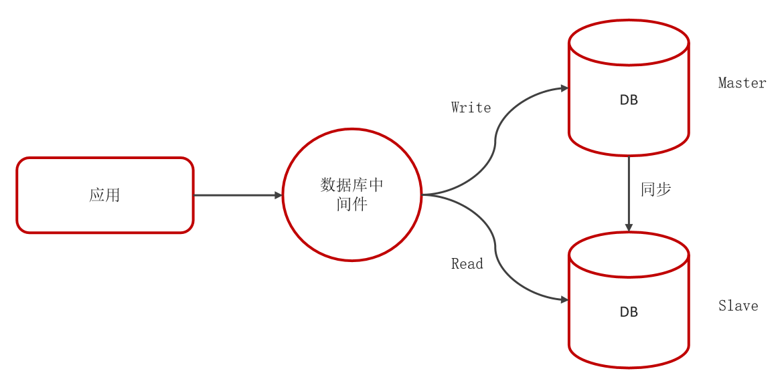
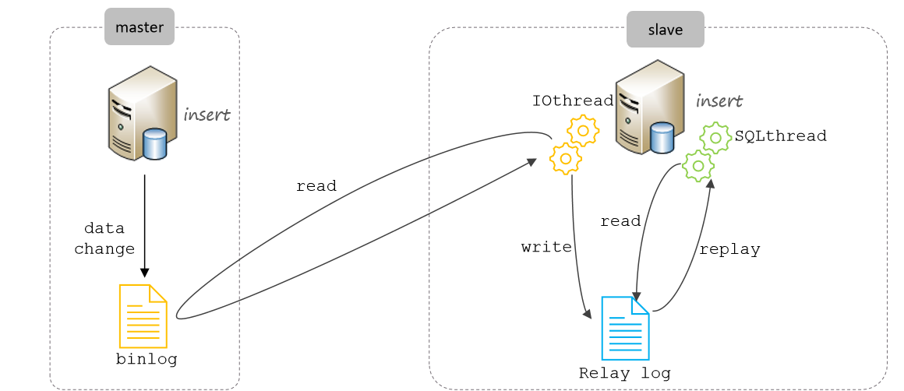

## Mysql的中从同步原理

主从的模式



主从同步的原理




核心就是binlog日志，Mysql的主库在事务提交时会有个binlog日志记录数据库的变化，从库有个线程IOthread去读去主库的binlog日志写入到从库的replylog日志中。然后从库的线程SqlThread执行relylog日志实现主从同步。


1. 主库开启binlog 日志
2. 主库的增删改操作，都会记录到binlog日志中。
3. 从库感知主库binlog的binlog日志的变化，每当发生改变，启用一个IO线程去读取主库binlog文件，并记录下来存在 Relay log（中继文件）中。
4. 最后利用Relay log 重放主库的bin log，完成数据同步。

tips: 

```java
1. `bin log` 日志怎么开启?  
2. 从库怎么感知主库的binlog 变化？
3. `bin log` 日志到底是什么，怎么能重放就能完成数据同步？
```

MySQL 的Binlog，它记录了所有的 DDL 和 DML语句，也就是记录了数据库中数据的变化。

`bin log `的应用

+ 数据复制（主从同步）。
+ 数据恢复（误操作恢复、灾难恢复）。
+ 变更数据捕获（实时数据同步、数据异构）。
+ 审计和日志分析

**Bin log 日志** 

1. **如何开启binlog 日志**

`MySQL 5. 7`默认情况下是不开启Binlog，因为记录Binlog日志需要消耗时间，官方给出的数据是有1%的性能损耗。最主要的是，早期阶段，那个时期往往是单机mysql。往往不需要进行数据复制，而且开启bin log 还要一些格外的配置

比如，设置 `server_id`：主从复制时，每个 MySQL 实例需要唯一的 `server_id`；选择 `binlog_format`：需要根据业务需求选择合适的 binlog 格式（STATEMENT、ROW 或 MIXED）。对于不熟悉 MySQL 的用户来说，这些配置可能会增加使用难度。

总的来说 `Mysql 5.7 `默认不开启`binlog `是因为以下三个方面

1. 往往是单机mysql。往往不需要进行数据复制。
2. 而且开启bin log 还要一些格外的配置，对不熟悉Mysql 的用户来说，会导致使用难度的增加。
3. 性能消耗（在现在来看微乎其微）


**MySQL 8.0 及以上版本**：binlog 默认是**开启**的。

可以通过sql 查看是否开启

```sql
SHOW VARIABLES LIKE 'log_bin';  
```

+ 如果返回结果为 `ON`，则表示 binlog 已开启。
+ 如果返回结果为 `OFF`，则表示 binlog 未开启。


如果 binlog 未开启，你可以通过以下步骤启用它：

**修改 MySQL 配置文件**

+ 找到 MySQL 的配置文件（通常是 `my.cnf` 或 `my.ini`）。

+ 在 `[mysqld]` 部分添加或修改以下配置：

  ```
  [mysqld]
  log_bin = /var/lib/mysql/mysql-bin.log  # binlog 文件路径
  server-id = 1                           # 服务器唯一 ID（主从复制时需要）
  binlog_format = ROW                    # 推荐使用 ROW 模式
  expire_logs_days = 7                   # 设置 binlog 过期时间（单位：天）
  ```

+ 配置说明：

  + `log_bin`：指定 binlog 文件的路径和名称。
  + `server_id`：每个 MySQL 实例需要唯一的 ID（主从复制时必需）。
  + `binlog_format`：binlog 的格式，推荐使用 `ROW` 模式（支持更精确的变更数据捕获）。
  + `expire_logs_days`：设置 binlog 文件的保留时间，避免磁盘空间被占满。

+ 重启服务， 再次验证是否开启  ```SHOW VARIABLES LIKE 'log_bin';```


 **binlog 的格式**

binlog 有三种格式，可以通过 `binlog_format` 参数设置：

1. **STATEMENT**：
   + 记录 SQL 语句。
   + 优点：日志文件较小。
   + 缺点：某些操作（如非确定性函数）可能导致主从不一致。
2. **ROW**（推荐）：
   + 记录每一行数据的变更。
   + 优点：精确记录数据变更，适用于数据同步和恢复。
   + 缺点：日志文件较大。
3. **MIXED**：
   + 结合 STATEMENT 和 ROW 模式。
   + 默认使用 STATEMENT，在某些情况下自动切换到 ROW。

可以通过以下命令查看当前 binlog 格式：

```shell
SHOW VARIABLES LIKE 'log_bin';  
```


MySQL 的Binlog，它记录了所有的 DDL 和 DML语句，也就是记录了数据库中数据的变化。

`bin log `的应用

+ 数据复制（主从同步）。
+ 数据恢复（误操作恢复、灾难恢复）。
+ 变更数据捕获（实时数据同步、数据异构）。
+ 审计和日志分析

