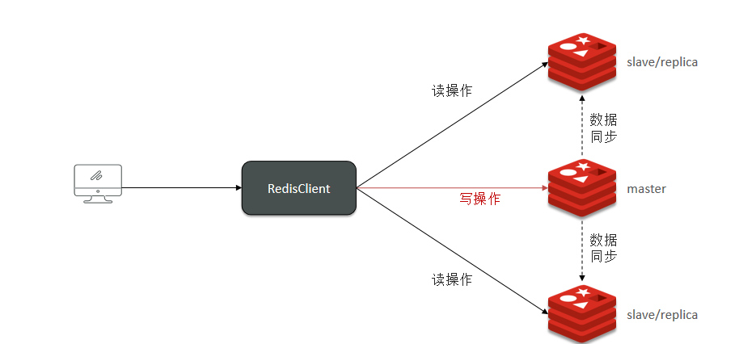
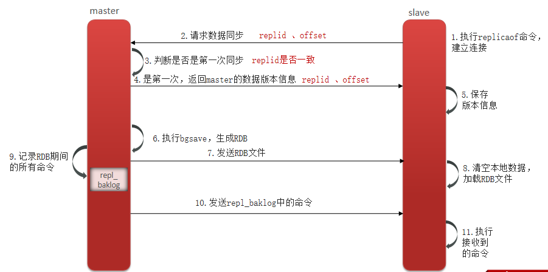
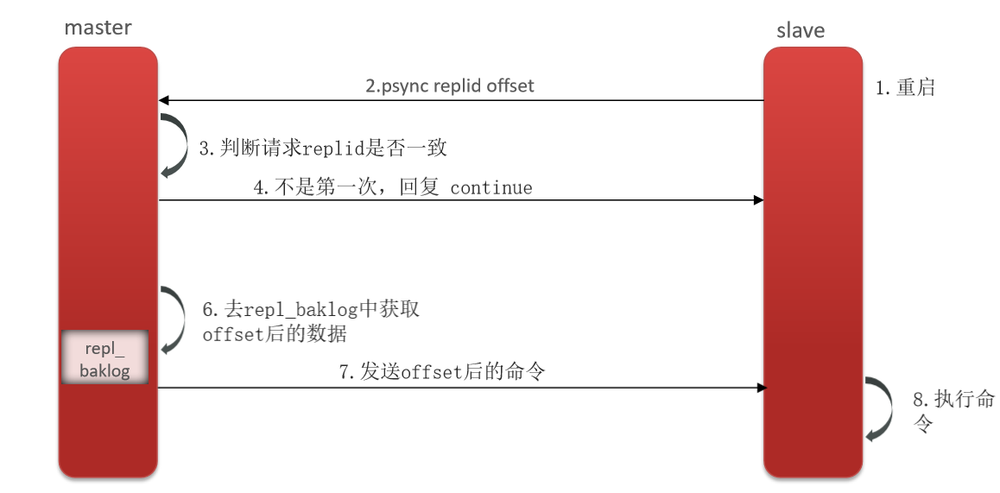

## Redis 主从复制，同步流程

​	单节点的Redis服务并不可靠，并发有上限。

* 如果服务器发生了宕机，由于数据恢复是需要点时间，那么这个期间是无法服务新的请求的；

*  如果这台服务器的硬盘出现了故障，可能数据就都丢失了。

  为了提高Redis 服务的可靠性，以及高性能，采用集群模式------主从复制。在主节点进行写操作，在从节点进行读操作。

​	具体的主从Redis节点的同步流程是这样子，分为首次同步，和增量同步。

首次同步，也就是全量同步

增量同步

* Replication Id：简称replid，是数据集的标记，id一致则说明是同一数据集。每一个master都有唯一的replid，slave则会继承master节点的replid

* offset：偏移量，随着记录在repl_baklog中的数据增多而逐渐增大。slave完成同步时也会记录当前同步的offset。如果slave的offset小于master的offset，说明slave数据落后于master，需要更新。

