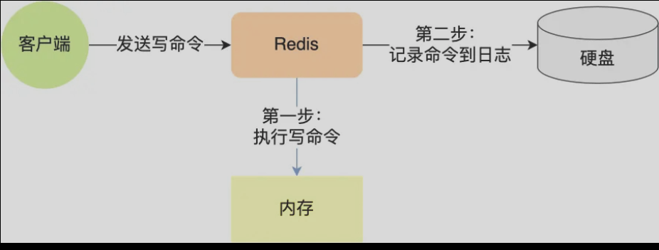
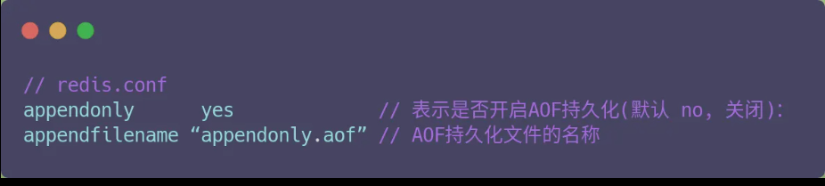
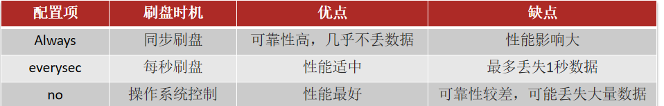

## Redis持久化策略

​	Redis是内存服务，但是提供了两个持久化策略AOF，RDB来持久化Redis的数据。

> AOF 日志文件

 Redis 每执行一条写操作命令成功后，就把该命令以追加的方式写入到一个文件里，然后重启Redis 的时候，先去读取这个文件里的命令，并且执行它，这不就相当于恢复了缓存数据了



在Redis中AOF持久化功能默认是不开启的，在redis.config文件中设置



AOF的记录命令的频率可以通过redis.config文件来配置

```shell
# 表示每执行一次写命令，立即记录到AOF文件
appendfsync always 
# 写命令执行完先放入AOF缓冲区，然后表示每隔1秒将缓冲区数据写到AOF文件，是默认方案
appendfsync everysec 
# 写命令执行完先放入AOF缓冲区，由操作系统决定何时将缓冲区内容写回磁盘
appendfsync no
```



因为是记录命令，AOF文件会比RDB文件大的多。而且AOF会记录对同一个key的多次写操作，但只有最后一次写操作才有意义。通过执行bgrewriteaof命令，可以让AOF文件执行重写功能，用最少的命令达到相同效果。

Redis也会在触发阈值时自动去重写AOF文件。阈值也可以在redis.conf中配置：

```shell
# AOF文件比上次文件 增长超过多少百分比则触发重写
auto-aof-rewrite-percentage 100
# AOF文件体积最小多大以上才触发重写 
auto-aof-rewrite-min-size 64mb 
```


> RDB

RDB全称Redis Database Backup file（Redis数据备份文件），也被叫做Redis数据快照。简单来说就是把内存中的所有数据都记录到磁盘中。当Redis实例故障重启后，从磁盘读取快照文件，恢复数据.

Redis 服务默认开启。用户可以手动备份

```shell
redis -cli
save # 由Redis主进程来执行RDB，会阻塞所有的命令
bgsave # 开启子进程执行RDB，避免主进程收到影响
```

当然Redis内部有自动触发RDB的机制，在redis.config中

```
# 900秒内，如果至少有1个key被修改，则执行bgsave 
save 900 1  
save 300 10  
save 60 10000 
```

​	这里提一点，Redis 的快照是全量快照，也就是说每次执行快照，都是把内存中的「所有数据」都记录到磁盘中。 所以可以认为，执行快照是一个比较重的操作，如果频率太频繁，可能会对 Redis 性能产生影响。如果频率太低，服务器故障时，丢失的数据会更 多。 通常可能设置至少 5 分钟才保存一次快照，这时如果 Redis 出现宕机等情况，则意味着最多可能丢失 5 分钟数据。 这就是 RDB 快照的缺点，在服务器发生故障时，丢失的数据会比 AOF 持久化的方式更多，因为 RDB 快照是全量快照的方式，因此执行的频率不能 太频繁，否则会影响 Redis 性能，而 AOF 日志可以以秒级的方式记录操作命令，所以丢失的数据就相对更少。


> 二者比较

这两种技术都会用各用一个日志文件来记录信息，但是记录的内容是不同的。

* AOF 文件的内容是操作命令；
* RDB 文件的内容是二进制数据。

RDB 快照就是记录某一个瞬间的内存数据，记录的是实际数据，而 AOF 文件记录的是命令操作的日志，而不是实际的数据。因此在 Redis 恢复数据时， RDB 恢复数据的效率会比 AOF 高些，因为直接将 RDB 文件读入内存就可以，不需要像 AOF 那样还需要额外执行操作 命令的步骤才能恢复数据