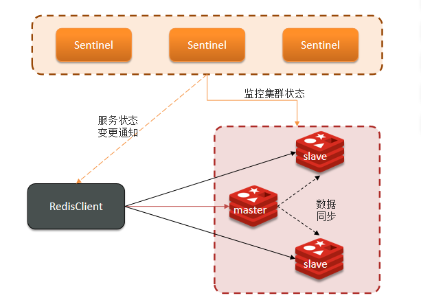

## Redis的哨兵模式

​	为了提高Redis的性能搭建主从集群后，当主节点出现问题，Redis服务就不可以进行写操作，服务就不可用，Redis提供了哨兵机制，来实现主从集群的自动故障恢复。	

​	哨兵的结构和作用

* 监控：Sentinel 会不断检查您的master和slave是否按预期工作。
  * 具体来说就是Sentinel 一直发送ping，接收pang，说明该节点正常可用，反之就是主观下线，当多个Sentinel （一般是一半哨兵监控redis节点为不可用）检测一个redis节点都说明该节点不可用后，该节点是客观下线（服务不可用）。

* 自动故障恢复：如果master故障，Sentinel会将一个slave提升为master。当故障实例恢复后也以新的master为主。
* 通知：Sentinel充当Redis客户端的服务发现来源，当集群发生故障转移时，会将最新信息推送给Redis的客户端。



>  补充

Sentinel基于心跳机制监测服务状态，每隔1秒向集群的每个实例发送ping命令：
主观下线：如果某sentinel节点发现某实例未在规定时间响应，则认为该实例主观下线。
客观下线：若超过指定数量（quorum）的sentinel都认为该实例主观下线，则该实例客观下线。quorum值最好超过Sentinel实例数量的一半。

哨兵选主规则
首先判断主与从节点断开时间长短，如超过指定值就排该从节点
然后判断从节点的slave-priority值，越小优先级越高
如果slave-prority一样，则判断slave节点的offset值，越大优先级越高
最后是判断slave节点的运行id大小，越小优先级越高。

> 脑裂问题

当哨兵网络与Redis主节不在同一个网络下，监控就会出问题，但是Redis主节点并没有问题，服务仍在Redis主节点写，由于网络问题哨兵通过监控认为Redis主节点出现了问题，就会在从节点选一个做为主节点，这样就出现了两个主节点，这就是脑裂问题，当网络原因回复后，原来的主节点为变成从节点，以新的主节点为主，原来的主节点会同步新的主节点信息，就会导致数据丢失。

解决方法 redis.config

```shell
min-replicas-to-write 1   表示最少的salve节点为1个
min-replicas-max-lag 5  表示数据复制和同步的延迟不能超过5秒
```

