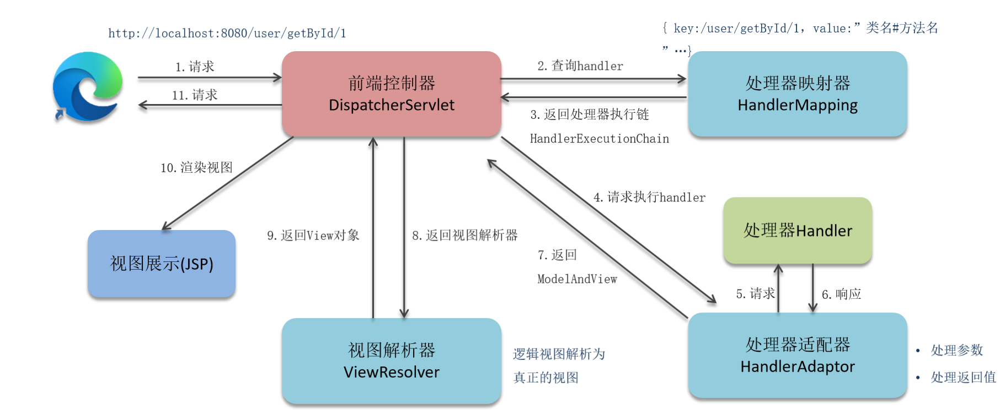
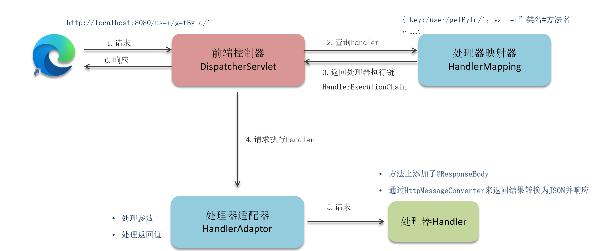

## SpringMvc的执行流程

客户端发出请求。

1. DispatcherServlet拦截（再次之前是Filter拦截，我们可以在Filter过滤不好的请求，比如说我们假如黑名单的用户），处理请求到HandlerMapping。
2. HandlerMapping找到具体的处理器，生成处理器对象及处理器拦截器(如果有)（处理器执行链），再一起返回给DispatcherServlet。
3. DispatcherServlet根据handlerMapping 的返回结果（处理器执行链），找到HanderAptor执行处理器执行链的方法(处理请求参数），然后找到对应的handler然后执行方法，然后再将结果响应给HandlerAdaptor（处理返回值）。
4. HandlerAdaptor处理后将ModeAndView返回给DispatcherServlet.
5. DispatcherServlet再将MoveAndView，返回给ViewResolver视图解析器，视图解析器返回给DispatcherServlet,真正的View对象，经过渲染展示视图。
6. DispatcherServlet返回结果给请求。

但是现在大部分都是前后端分离开发，流程有些变化。

在HandlerApator处理handler时，加上@RequestBody。通过HttpMessage来处理返回结果,转化为json对象.返回给前端。

