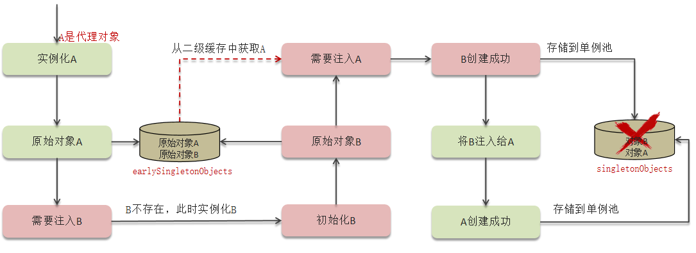

## Spring的循环依赖，怎么解决？

循环依赖，就是bean在创建的时候，A依赖B才能创建成功，B依赖A能创建成功。

具体来说就是，在A创建的时候,A的生命周期是这样的，先根据`BeanDefinition`通过构造器实例化A,然后A的生命周期到达了依赖注入的阶段（也就是赋值的阶段 @Value, @Autowired等）这时候就需要B，但是B还不存在，所以B就实例化，然后依赖注入，发现需要A,但是A还不存在。这就是循环依赖。

怎么解决？

循环依赖在spring中是允许存在，spring框架依据三级缓存已经解决了大部分的循环依赖。

①一级缓存：单例池，缓存已经经历了完整的生命周期，已经初始化完成的bean对象。

②二级缓存：缓存早期的bean对象（生命周期还没走完）

③三级缓存：缓存的是ObjectFactory，表示对象工厂，用来创建某个对象的。

二级缓存

但是不能创建代理对象。

三级缓存

这三级缓存解决了大部分的循环依赖问题，但是从循环依赖产生的过程来思考：这些都是依赖注入是产生的循环依赖问题（ｓｅｔｔｅｒｒ注入）。还有的是构造器依赖注入，那么可以是懒加载。