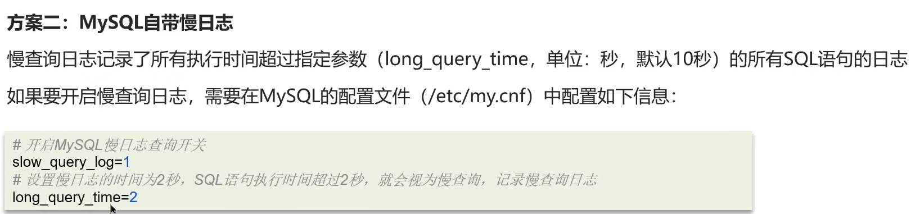

## 1.怎么定位慢查询

**面试官：**MySQL中，如何定位慢查询?

**候选人：**

嗯~，我们当时做压测的时候有的接口非常的慢，接口的响应时间超过了2秒以上，因为我们当时的系统部署了运维的监控系统Skywalking ，在展示的报表中可以看到是哪一个接口比较慢，并且可以分析这个接口哪部分比较慢，这里可以看到SQL的具体的执行时间，所以可以定位是哪个sql出了问题

如果，项目中没有这种运维的监控系统，其实在MySQL中也提供了慢日志查询的功能，可以在MySQL的系统配置文件中开启这个慢日志的功能，并且也可以设置SQL执行超过多少时间来记录到一个日志文件中，我记得上一个项目配置的是2秒，只要SQL执行的时间超过了2秒就会记录到日志文件中，我们就可以在日志文件找到执行比较慢的SQL了。

## 2.sql执行很慢如何分析

**面试官：**那这个SQL语句执行很慢, 如何分析呢？

**候选人：**如果一条sql执行很慢的话，我们通常会使用mysql自动的执行计划explain来去查看这条sql的执行情况，比如在这里面可以通过key和key_len检查是否命中了索引，如果本身已经添加了索引，也可以判断索引是否有失效的情况，第二个，可以通过type字段查看sql是否有进一步的优化空间，是否存在全索引扫描或全盘扫描，第三个可以通过extra建议来判断，是否出现了回表的情况，如果出现了，可以尝试添加索引或修改返回字段来修复

通常慢sql的情况

* 聚合查询---->新增临时表
* 多表查询---->优化sql语句的结构，小表驱动大表。
* 表数据量过大--->添加索引
* 深度分页查询---->先查需要的id查，在根据id查。

## 3. 了解索引吗？什么是索引,底层数据结构是什么？

**面试官：**了解过索引吗？（什么是索引）

**候选人：**嗯，索引在项目中还是比较常见的，它是帮助MySQL高效获取数据的数据结构，主要是用来提高数据检索的效率，降低数据库的IO成本，同时通过索引列对数据进行排序，降低数据排序的成本，也能降低了CPU的消耗

**面试官：**索引的底层数据结构了解过嘛 ? 

**候选人：**MySQL的默认的存储引擎InnoDB采用的B+树的数据结构来存储索引，选择B+树的主要的原因是：第一阶数更多，路径更短，第二个磁盘读写代价B+树更低，非叶子节点只存储指针，叶子阶段存储数据，第三是B+树便于扫库和区间查询，叶子节点是一个双向链表

**面试官：**B树和B+树的区别是什么呢？

**候选人**：第一：在B树中，非叶子节点和叶子节点都会存放数据，而B+树的所有的数据都会出现在叶子节点，在查询的时候，B+树查找效率更加稳定

第二：在进行范围查询的时候，B+树效率更高，因为B+树都在叶子节点存储，并且叶子节点是一个双向链表

## 4.什么是聚簇索引什么是非聚簇索引 

**面试官：**什么是聚簇索引什么是非聚簇索引 ?

**候选人：**

好的~，聚簇索引主要是指数据与索引放到一块，B+树的叶子节点保存了整行数据，有且只有一个，一般情况下主键在作为聚簇索引的

非聚簇索引值的是数据与索引分开存储，B+树的叶子节点保存对应的主键，可以有多个，一般我们自己定义的索引都是非聚簇索引

**面试官：**知道什么是回表查询嘛 ?

**候选人：**嗯，其实跟刚才介绍的聚簇索引和非聚簇索引是有关系的，回表的意思就是通过二级索引找到对应的主键值，然后再通过主键值找到聚集索引中所对应的整行数据，这个过程就是回表

>
>
>

## 5. 知道什么叫覆盖索引嘛 ?

> **面试官：**知道什么叫覆盖索引嘛 ? 
>
> **候选人：**嗯~，清楚的
>
> 覆盖索引是指select查询语句使用了索引，在返回的列，必须在索引中全部能够找到，如果我们使用id查询，它会直接走聚集索引查询，一次索引扫描，直接返回数据，性能高。
>
> 如果按照二级索引查询数据的时候，返回的列中没有创建索引，有可能会触发回表查询，尽量避免使用select *，尽量在返回的列中都包含添加索引的字段
>

## 6. 超大分页怎么优化

> **面试官：**MYSQL超大分页怎么处理 ?
>
> **候选人：**嗯，超大分页一般都是在数据量比较大时，我们使用了limit分页查询，并且需要对数据进行排序，这个时候效率就很低，我们可以采用覆盖索引和子查询来解决
>
> 先分页查询数据的id字段，确定了id之后，再用子查询来过滤，只查询这个id列表中的数据就可以了
>
> 因为查询id的时候，走的覆盖索引，所以效率可以提升很多

## 7. 索引创建的原则有哪些？

> **面试官：**索引创建原则有哪些？
>
> **候选人：**嗯，这个情况有很多，不过都有一个大前提，就是表中的数据要超过10万以上，我们才会创建索引，并且添加索引的字段是查询比较频繁的字段，一般也是像作为查询条件，排序字段或分组的字段这些。
>
> 还有就是，我们通常创建索引的时候都是使用复合索引来创建，一条sql的返回值，尽量使用覆盖索引，如果字段的区分度不高的话，我们也会把它放在组合索引后面的字段。
>
> 如果某一个字段的内容较长，我们会考虑使用前缀索引来使用，当然并不是所有的字段都要添加索引，这个索引的数量也要控制，因为添加索引也会导致新增改的速度变慢。

## 8. 什么情况下索引会失效 ?

**面试官：**什么情况下索引会失效 ?

**候选人：**嗯，这个情况比较多，我说一些自己的经验，以前遇到过的

比如，在之前的项目中，一个题库题目关系表，是这样设置的表，id，questionBankid,questionid, 并且添加唯一的联合索引，questionBankid,questionid,来确保，题目只能添加到一次相同题库中。在查询这个表的时候，使用quesitonbankid和quesitonid,写sql的前后顺序会导致索引失效。索引在使用的时候没有遵循最左匹配法则，第二个是，模糊查询，如果%号在前面也会导致索引失效。如果在添加索引的字段上进行了运算操作（比如说字符串的截取）或者类型转换（索引是字符串，sql传值没有加字符串，会有个默认的转换）也都会导致索引失效。

我们之前还遇到过一个就是，如果使用了复合索引，中间使用了范围查询，右边的条件索引也会失效

所以，通常情况下，想要判断出这条sql是否有索引失效的情况，可以使用explain执行计划来分析。

## 9. sql优化的经验

> **面试官：**sql的优化的经验
>
> **候选人：**嗯，这个在项目还是挺常见的，当然如果直说sql优化的话，我们会从这几方面考虑，
>
> 1.表的设计优化------选择合适的字段类型，添加索引
>
> 2.sql语句的优化-----避免sql索引失效（违反最左匹配原则，模糊查询%在前，在添加索引的字段进行运算操作，或者类型转换，使用复合索引范围查询的时候右边的条件会失效），避免产生回表（不使用select * ,以及添加联合索引）；小表驱动大表；
>
> 3.部署的优化，主从复制，读写分离，分库分表。
>
> 建表的时候、使用索引、sql语句的编写、主从复制，读写分离，还有一个是如果量比较大的话，可以考虑分库分表
>
> **面试官：**创建表的时候，你们是如何优化的呢？
>
> **候选人：**这个我们主要参考的阿里出的那个开发手册《嵩山版》，就比如，在定义字段的时候需要结合字段的内容来选择合适的类型，如果是数值的话，像tinyint、int 、bigint这些类型，要根据实际情况选择。如果是字符串类型，也是结合存储的内容来选择char和varchar或者text类型
>
> **面试官：**那在使用索引的时候，是如何优化呢？
>
> **候选人：**【参考索引创建原则    进行描述】
>
> **面试官：**你平时对sql语句做了哪些优化呢？
>
> **候选人：**嗯，这个也有很多，比如SELECT语句务必指明字段名称，不要直接使用select * ，还有就是要注意SQL语句避免造成索引失效的写法；如果是聚合查询，尽量用union all代替union ，union会多一次过滤，效率比较低；如果是表关联的话，尽量使用innerjoin ，不要使用用left join right join，如必须使用 一定要以小表为驱动

## 10. 事务的特性是什么

事务时一组操作的集合，它时一个不可分割的单位，事务会把所有的操作作为一个整体向系统提交或撤销操作请求，即这写操作要么都成功，要么都失败

> **面试官：**事务的特性是什么？可以详细说一下吗？
>
> **候选人：**嗯，这个比较清楚，ACID，分别指的是：原子性、一致性、隔离性、持久性；我举个例子：
>
> A向B转账500，转账成功，A扣除500元，B增加500元，原子操作体现在要么都成功，要么都失败
>
> 在转账的过程中，数据要一致，A扣除了500，B必须增加500
>
> 在转账的过程中，隔离性体现在A像B转账，不能受其他事务干扰
>
> 在转账的过程中，持久性体现在事务提交后，要把数据持久化（可以说是落盘操作）

## 11.并发事务带来哪些问题？怎么解决

> **面试官**：并发事务带来哪些问题？
>
> **候选人**：
>
> 我们在项目开发中，多个事务并发进行是经常发生的，并发也是必然的，有可能导致一些问题
>
> 第一是脏读， 当一个事务正在访问数据并且对数据进行了修改，而这种修改还没有提交到数据库中，这时另外一个事务也访问了这个数据，因为这个数据是还没有提交的数据，那么另外一个事务读到的这个数据是“脏数据”，依据“脏数据”所做的操作可能是不正确的。
>
> 第二是不可重复读：比如在一个事务内多次读同一数据。在这个事务还没有结束时，另一个事务也访问该数据。那么，在第一个事务中的两次读数据之间，由于第二个事务的修改导致第一个事务两次读取的数据可能不太一样。这就发生了在一个事务内两次读到的数据是不一样的情况，因此称为不可重复读。
>
> 第三是幻读（Phantom read）：幻读与不可重复读类似。它发生在一个事务（T1）读取了几行数据，接着另一个并发事务（T2）插入了一些数据时。在随后的查询中，第一个事务（T1）就会发现多了一些原本不存在的记录，就好像发生了幻觉一样，所以称为幻读。
>
> **面试官**：怎么解决这些问题呢？MySQL的默认隔离级别是？
>
> **候选人**：解决方案是对事务进行隔离
>
> MySQL支持四种隔离级别，分别有：
>
> 第一个是，未提交读（read uncommitted）它解决不了刚才提出的所有问题，一般项目中也不用这个。第二个是读已提交（read committed）它能解决脏读的问题的，但是解决不了不可重复读和幻读。第三个是可重复读（repeatable read）它能解决脏读和不可重复读，但是解决不了幻读，这个也是mysql默认的隔离级别。第四个是串行化（serializable）它可以解决刚才提出来的所有问题，但是由于让是事务串行执行的，性能比较低。所以，我们一般使用的都是mysql默认的隔离级别:可重复读

## 12 undo log和redo log的区别

>**面试官**：undo log和redo log的区别
>
>**候选人**：好的，其中redo log日志记录的是数据页的物理变化，服务宕机可用来同步数据，而undo log 不同，它主要记录的是逻辑日志，当事务回滚时，通过逆操作恢复原来的数据，比如我们删除一条数据的时候，就会在undo log日志文件中新增一条delete语句，如果发生回滚就执行逆操作；
>
>redo log保证了事务的持久性，undo log保证了事务的原子性和一致性

