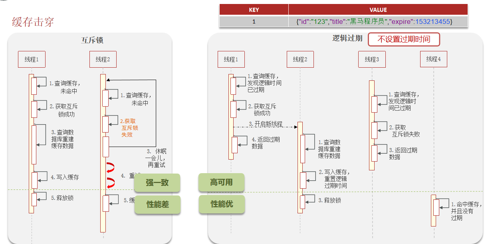

# Redis面试题

## 什么是缓存穿透 ? 怎么解决 ?

**面试官**：什么是缓存穿透 ? 怎么解决 ?

**候选人**：

嗯~~，我想一下

缓存穿透是指查询一个一定**不存在**的数据，如果从存储层查不到数据则不写入缓存，这将导致这个不存在的数据每次请求都要到 DB 去查询，可能导致 DB 挂掉。这种情况大概率是遭到了攻击。

解决方案的话，我们通常都会用布隆过滤器来解决它，

**面试官**：好的，你能介绍一下布隆过滤器吗？

**候选人**：

嗯，是这样~

布隆过滤器主要是用于检索一个元素是否在一个集合中。我们当时使用的是redisson实现的布隆过滤器。

它的底层主要是先去初始化一个比较大数组，里面存放的二进制0或1。在一开始都是0，当一个key来了之后经过3次hash计算，模于数组长度找到数据的下标然后把数组中原来的0改为1，这样的话，三个数组的位置就能标明一个key的存在。查找的过程也是一样的。

当然是有缺点的，布隆过滤器有可能会产生一定的误判，我们一般可以设置这个误判率，大概不会超过5%，其实这个误判是必然存在的，要不就得增加数组的长度，其实已经算是很划分了，5%以内的误判率一般的项目也能接受，不至于高并发下压倒数据库。

## 什么是缓存击穿 ? 怎么解决 ?

**候选人**：

嗯！！

缓存击穿是指在高并发的情况下，当某个热点数据的缓存突然失效（过期或被删除）时，大量请求直接穿透到后端数据库，导致数据库负载过高，甚至崩溃的问题。这种情况通常发生在缓存中的热点数据过期或失效时，由于并发用户特别多，同时读缓存没读到数据，又同时去数据库中取数据，引起数据库压力瞬间增大。

解决方案有两种方式：

第一可以使用互斥锁：当缓存失效时，不立即去load db，先使用如 Redis 的 setnx 去设置一个互斥锁，当操作成功返回时再进行 load db的操作并回设缓存，否则重试get缓存的方法

第二种方案可以设置当前key逻辑过期，大概是思路如下：

①：在设置key的时候，设置一个过期时间字段一块存入缓存中，不给当前key设置过期时间

②：当查询的时候，从redis取出数据后判断时间是否过期

③：如果过期则开通另外一个线程进行数据同步，当前线程正常返回数据，这个数据不是最新

当然两种方案各有利弊：

如果选择数据的强一致性，建议使用分布式锁的方案，性能上可能没那么高，锁需要等，也有可能产生死锁的问题

如果选择key的逻辑删除，则优先考虑的高可用性，性能比较高，但是数据同步这块做不到强一致。

