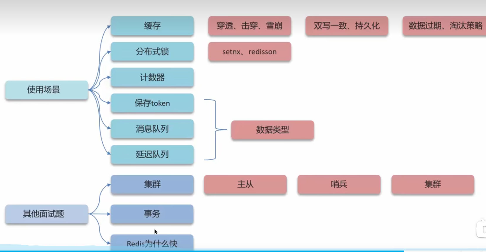

# Redis面试题

## 什么是缓存穿透 ? 怎么解决 ?

**面试官**：什么是缓存穿透 ? 怎么解决 ?

**候选人**：

嗯~~，我想一下

缓存穿透是指查询一个一定**不存在**的数据，如果从存储层查不到数据则不写入缓存，这将导致这个不存在的数据每次请求都要到 DB 去查询，可能导致 DB 挂掉。这种情况大概率是遭到了攻击。

解决方案的话，我们通常都会用布隆过滤器来解决它，

**面试官**：好的，你能介绍一下布隆过滤器吗？

**候选人**：

嗯，是这样~

布隆过滤器主要是用于检索一个元素是否在一个集合中。我们当时使用的是redisson实现的布隆过滤器。

它的底层主要是先去初始化一个比较大数组，里面存放的二进制0或1。在一开始都是0，当一个key来了之后经过3次hash计算，模于数组长度找到数据的下标然后把数组中原来的0改为1，这样的话，三个数组的位置就能标明一个key的存在。查找的过程也是一样的。

当然是有缺点的，布隆过滤器有可能会产生一定的误判，我们一般可以设置这个误判率，大概不会超过5%，其实这个误判是必然存在的，要不就得增加数组的长度，其实已经算是很划分了，5%以内的误判率一般的项目也能接受，不至于高并发下压倒数据库。

