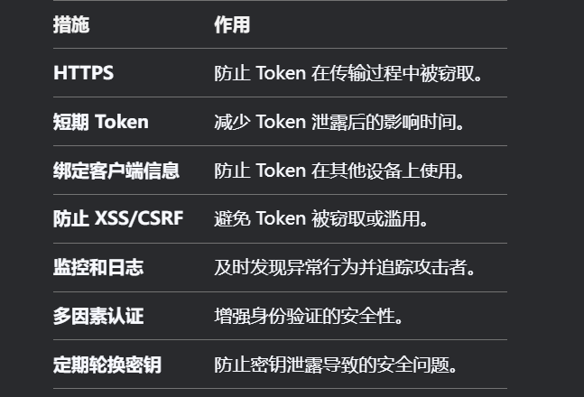

## 北京领雁科技股份有限公司 java实习 （银行驻场外包）

1. 介绍下平时用那些集合

2. ArrayList和LinkedList 区别？

3. 看你简历提到了多线程，你一般什么时候使用多线线程？

答：先说一下使用多线程的目的。然后介绍项目中怎么用的（数据库ES库同步，以及批量操作，同时说业务中遇到的问题）。

4. 你对线程池的了解？

答： 核心参数， 拒绝策略，工作队列，整个线程池的工作流程。

2. 了解的数据库

   Mysql Redis ES

3. grouby distinct 的区别

4. sql的执行顺序（不知道）

5. 索引的作用？

6. 所有的表都适合加索引？

7. 了解那些设计模式（不知道）？

   答：单例，策略，责任链，之前学过现在不太清楚了。

8. redis 用过那些数据类型？

答： 介绍一下应用场景，比如说解决session共享问题，用redis存储token,用token， Hash类型存用户信息等。

9 别人拦截到token，伪造请求，请求服务怎么解决。

答： 加密JWT什么的（我感觉不对）， 他说刷新token。

10 有实习过吗？ 没有

11 注册中心的了解。

nacos  作为注册中心的优点（统一管理，版本控制），同时说明没有本地配置的缺点。

12  git 冲突怎么解决。

答： 我说了个应用场景：我和面试官，早上从远程仓库拉代码进行开发，晚上我提交远程仓库报错，原因说面试官更早的提交导致，我拉的代码和远程仓库不一致。解决就是在拉一次下来，再去提交。

13 加入公司想得到什么。

14 反问

招实习生具体干什么的？

面试官：完成一些简单的开发，跟着一起熟悉项目需求，开发文档 。

主要业务是什么。

面试管：在银行工作，做银行app 整体的配置项目。（不太懂继续问），在使用app的时候，会有图xxx,他们是怎么布局的，点击跳转到对应的连接上 。是由我们的系统去控制（还是不太了解，我问是前端吗）。说我们提供配置信息，具体的话是由客户端拿到这个连接 去跳转，我们做配置。是一个运营类的系统。（我现在还不太了解）

还有其他二面吗？什么时候。

## Sql 执行的顺序

| 步骤 | 子句               | 作用                                                |
| :--- | :----------------- | :-------------------------------------------------- |
| 1    | **FROM**           | 确定数据来源（表、子查询、连接等）。                |
| 2    | **WHERE**          | 过滤行（基于条件，在分组前过滤）。                  |
| 3    | **GROUP BY**       | 将数据按指定列分组。                                |
| 4    | **HAVING**         | 过滤分组后的结果（基于聚合值，如 `SUM`, `COUNT`）。 |
| 5    | **SELECT**         | 选择最终输出的列，并计算表达式或聚合函数。          |
| 6    | **DISTINCT**       | 去重（移除重复行）。                                |
| 7    | **ORDER BY**       | 对结果排序。                                        |
| 8    | **LIMIT / OFFSET** | 限制返回的行数或跳过指定行（如分页）。              |

* JOIN(如果有　join　操作)　在FROM子句之后执行。

## 总结

面试管的提问都是发散性的，不会直接问xxx是什么？,都是问一些你那里用了，怎么用的，在回答的过程中尽管只问一个简单的小问题，也不要只回答这一点点，可能的回答自己所知道的知识。在回答中提到涉及的知识，面试官又会去追问。所以说我们回答面试管某一个问题时候，回答该问题的时候尽量发散回答，最好结合应用场景去回答。

技术面结束，10分钟不到，HR通知面试通过，也没有后续面试，我追问什么时候入职，现在还没有回复。

顺便请教一下：25届没实习，现在找实习还是直接春招。

