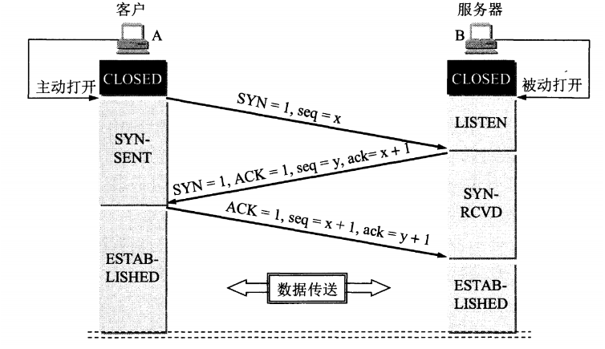
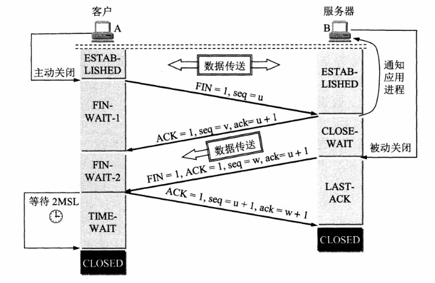

##  TCP的三次握手和四次挥手

TCP协议是在传输层的应用协议，是面向连接的可靠传输的协议。

+ 用户数据报协议 UDP（User Datagram Protocol）是无连接的，尽最大可能交付，没有拥塞控制，面向报文（对于应用程序传下来的报文不合并也不拆分，只是添加 UDP 首部），支持一对一、一对多、多对一和多对多的交互通信。
+ 传输控制协议 TCP（Transmission Control Protocol）是面向连接的，提供可靠交付，有流量控制，拥塞控制，提供全双工通信，面向字节流（把应用层传下来的报文看成字节流，把字节流组织成大小不等的数据块），每一条 TCP 连接只能是点对点的（一对一）。

**TCP三次握手**

第一次握手：客户端向服务器发送连接请求，确保该**客户端发送消息是正常的**，**服务器接收消息是正常的**。

第二次握手：服务器向客户端发送确认连接，保证了**服务器向客户端发送消息是正常的**，**客户端接收服务器的消息是正常的**。

第三次握手：客户端向服务器发送确认连接，两者连接成功。

tips: 两次握手已经解决了客户端和服务器之间相互收发消息是正常的，为什么还要进行三次握手。

+ 在网络中，数据包可能会延迟或重复到达。如果客户端发送的连接请求（SYN）在网络中滞留（但最终还是会到达服务器），客户端可能会重发SYN。如果没有三次握手，服务器可能会错误地建立多个连接。
+ 通过三次握手，客户端在收到服务器的SYN-ACK后，会发送一个确认（ACK），服务器只有在收到ACK后才会建立连接。这样可以避免旧的重复SYN包导致无效连接。

**TCP四次挥手**

TCP使用四次挥手来终止连接，确保双方都能安全地关闭连接并释放资源。四次挥手的设计是为了处理**双向通信的关闭**问题，因为TCP连接是全双工的，双方都需要独立关闭自己的发送和接收通道。

 **四次挥手的过程**

1. **第一次挥手（FIN）**：
   + 客户端决定关闭连接，发送一个FIN报文（FIN=1），并带上自己的序列号（seq=u）。
   + 发送方进入**FIN_WAIT_1**状态，表示自己不再发送数据，但仍可以接收数据。
2. **第二次挥手（ACK）**：
   + 服务器收到FIN报文后，发送一个ACK报文（ACK=1），确认号为u+1（ack=u+1），并带上自己的序列号（seq=v）。
   + 服务器进入**CLOSE_WAIT**状态，表示自己已经知道对方要关闭连接，关闭接收消息的通道，但仍可以发送数据。
   + 客户端收到ACK后，进入**FIN_WAIT_2**状态，等待接收方的FIN报文。
3. **第三次挥手（FIN）**：
   + 接收方完成数据发送后，发送一个FIN报文（FIN=1），确认号仍为u+1（ack=u+1），并带上自己的序列号（seq=w）。
   + 接收方进入**LAST_ACK**状态，等待发送方的最后一个ACK。
4. **第四次挥手（ACK）**：
   + 发送方收到FIN报文后，发送一个ACK报文（ACK=1），确认号为w+1（ack=w+1），并带上自己的序列号（seq=u+1）。
   + 发送方进入**TIME_WAIT**状态，等待2MSL（最大报文段生存时间）后关闭连接。
   + 接收方收到ACK后，立即关闭连接。